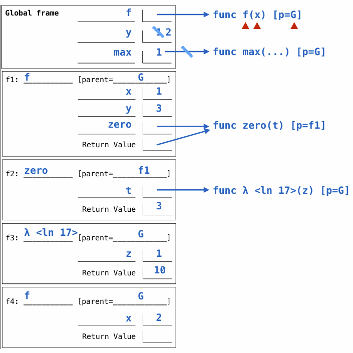

这篇笔记包含前四周的内容，介绍Python基础。由于python的递归（第四周）和其它语言没有任何区别，跳过。 

## 介绍

*（基本与github上的README介绍内容相同）*

CS61A是伯克利CS61系列的第一门课，介绍了Python、scheme和SQL，可以看作程序设计和函数式语言基础，比起其它课程，这门课可以说是对自学者非常友好，课程网站上每个lab、hw和project都有相应的评分程序。注意（不记得是从哪年开始），CS61A往年课程网站不对外展示，如果想从官方网站学习，一定要注意学期的开始和结束日期，在下一学期开始前完成，否则网站会被更新成下一学期的状态。   

CS61A 网页：  
[https://cs61a.org/](https://cs61a.org/)

我的github库：  
[https://github.com/key4127/CS61A](https://github.com/key4127/CS61A)  

## 控制流

### 条件

```python
if x > 2:
    print('big')
elif x > 0:
    print('less big')
else:
    print('not pos')
```

### 循环

```python
i, total = 0, 0
while i < 3:
    i = i + 1
    total = total + i
```

## 函数

### 高阶函数

```python
def make_adder(n):
    def adder(k):
        return k + n
    return adder
```

### lambda函数

```python
>>> (lambda f: lambda x: f(f(x)))(lambda y: y * y)(3)
>>> 81
```

``lambda f: lambda x: f(f(x))`` 是一个lambda函数，有一个函数作为参数，注意**冒号后面是返回值**。它的返回值是一个以x为参数的函数，即 ``(lambda f: lambda x: f(f(x)))(lambda y: y * y)`` ，在以3为参数调用这个函数。  

### ``return`` 与 ``print``

对于这道题  

```python
# Lab02 Q2: Higher-Order Function
def cake():
    print('beets')
    def pie():
        print('sweets')
        return 'cake'
    return pie
```

会发现 ``print`` 得到的是 ``beets`` ，但 ``return`` 得到的结果是 ``'cake'`` 。事实上，这与对象的 ``__str__()`` 方法和 ``__repr__()`` 方法有关，在若干周后学习。  

## 环境

```python
def f(x):
    y = max(x * x, 3 * x)
    def zero(t):
        if t(x) > 0:
            return y
        return 0
    return zero

y = 1
while y < 10:
    if f(y)(lambda z: z - y + 10):
        max = y
    y = y + 1
```

