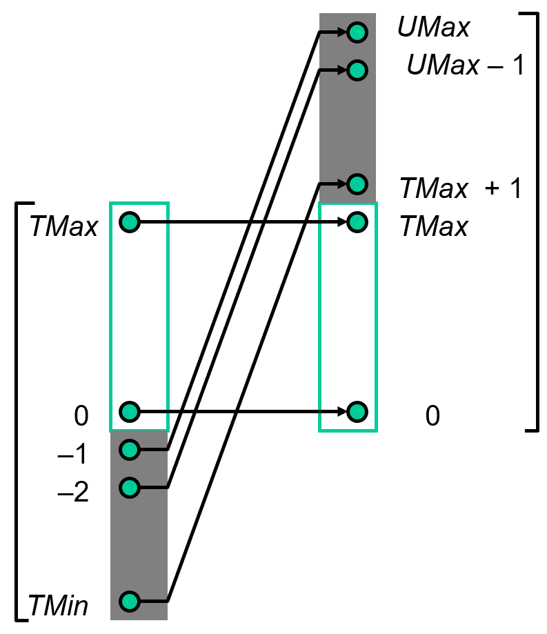

这篇笔记包含lecture1-2, 4-5，所有与bits相关的内容。其中二、八、十六进制转换以及C语言基础跳过。

## 介绍

sjtu的ICS1、2基本为CSAPP的部分内容。

这个合集包含CSAPP和上海交通大学ICS1、2的笔记。由于ICS基本上讲解的是CSAPP内容，不单列两个合集了。对于两门课程中重叠的部分，笔记会专注于ICS。  

我的CSAPP库：  
[https://github.com/key4127/CSAPP](https://github.com/key4127/CSAPP)  

我的ICS库（暂不开放）：

## 位运算

位运算符的介绍跳过。  

通过异或的swap函数如下：  

```C
int swap(int *x, int *y)
{
    *x = *x ^ *y;
    *y = *x ^ *y; // *x ^ *y ^ *y
    *x = *x ^ *y; // *x ^ *y ^ *x
}
```

注意右移操作分为逻辑右移和算数右移。进行逻辑右移时，高位用符号位填充。即正数的逻辑右移和算数右移相同；对于负数，例如 ``1000`` （4位），逻辑右移二位为 ``1110`` 。

### Mask Operations

通过某个二进制可以对原数据进行相应操作。例如，对于十六进制 ``0xFF`` ，``x & 0xFF`` 可以提取出x的前八位，x ^ ~0xFF 可以保持前八位不变的同时对后面的位取反， x | 0xFF 可以将前八位置为1，后八位不变。

一些具体的使用方式：  

|运算符| 0 | 1 |
|:---:|:-:|:-:|
|&|置0|不变|
|\||不变|置1|
|^|不变|取反|

- ~：取反
- \<\<\/\>\>：乘/除 $2^x$

mask的使用示例：bitCount（统计1的数量）。   

```C
//There are more readable ways
int bitCount(int x)
{
    int m1 = 0x11 | (0x11 << 8);
    int mask = m1 | (m1 << 16);

    int s = x & mask;
    s += x >> 1 & mask;
    s += x >> 2 & mask;
    s += x >> 3 & mask;

    s = s + (s >> 16);
    mask = 0xF | (0xF << 8);
    s = (s & mask) + ((s >> 4) & mask);
    return (s + (s >> 8)) & 0x3F;
}
```

## 数据存储 运算

数据存储部分介绍了原码、反码、补码以及int的signed和unsigned类型。对于 $n$ 位无符号数，数据范围从 $0$ 到 $2^n - 1$ ；对于有符号数，数据范围从 $-2^{n - 1}$ 到 $2^{n - 1} - 1$ ，即 $|T_{min}| = T_{max} + 1$ ， $U_{max} = |T_{min}| \times 2$ 。所以，如果将补码表示的 $x$ 转为无符号数，如果 $x \ge 0$ ， $ux = x$ ；如果 $x < 0$ ， $ux = x + 2 ^ n$ 。 

  

在32位和64位机器中，同样的数据类型可能有不同的数据范围。此外，C语言要求对于各种数据类型，所有编译器必须能支持一定范围的数据。  

 

（32位机器中， ``char`` ``short`` ``long`` 分别为1字节、2字节、四字节）  

  

  

### 类型转换

将（同类型的）有符号数转为无符号数，类型转换时不会改变位存储的值，即正数不变，负数变为正数。C将所有数默认为符号数，在有符号数和无符号数混合运算时，会先将有符号数转为无符号数，例如 ``-1 > 0U`` 。  

在将位数较小的数类型转换到位数较大的数时，对于无符号数和正数，可以直接在前面补0。对于有符号负数，类似逻辑右移，需要将高位补为符号位（即1）。这两种转换都不会对数值产生影响。  

将位数较大的数转为位数较小的数时，会直接截取long中相应的位。  

如果同时需要改变位数和符号，则先改变位数，后处理符号，即先转为对应位数的数，然后按照需要的符号解码。  

例如  

```C
char a = -9;
unsigned short c = a;
```

其中 ``c`` 的值为65536。

### 运算

运算部分介绍了计算机中的运算（加、减、乘）。计算时，与普通的计算相同，抛弃溢出位。  