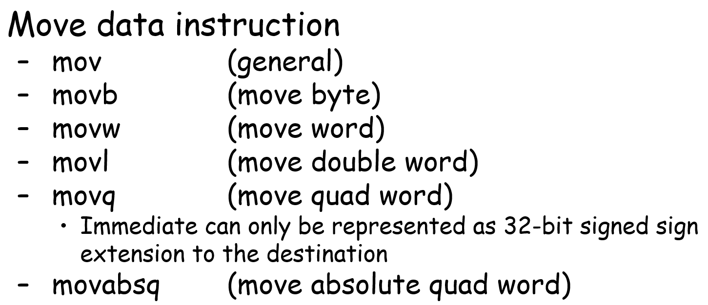
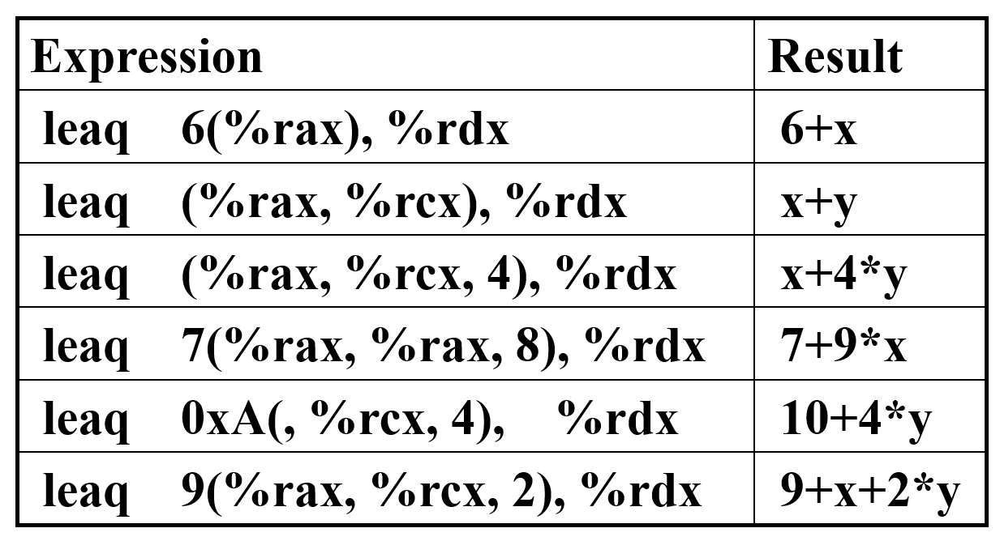

这篇笔记包含lecture6-8的内容，介绍了顺序结构下的x86汇编、mov和jmp。  

## 顺序结构

### 操作数

操作数有三种表示方式：  

- ``%rax`` ：寄存器
- ``8(%rbx)`` ：内存
- ``$4`` ：立即数

例如对于这段c代码

```C
*dest = t;
*dest += 4;
```

对应的汇编为

```x86asm
movq %rax, (%rbx)
addq $4, (%rbx)
```

### 寄存器

获取寄存器中的数据比内存块，但内存器数量较少，并有固定的名字。  

整型寄存器（8字节）：  


浮点型寄存器（32字节）：  


注意不同寄存器的位数可能不同。  

对于名为 ``%rax`` 的寄存器，存储的内容写作 ``R[ra]`` 。

### 内存

虚拟空间是一个线性的数组，下标从0开始。``M`` 为数组名，``addr`` 为内存地址，``M[addr]`` 是从addr地址开始的内存内容。  

索引寻址是一个计算地址的表达式，常见的格式是 ``Imm(rb, ri, s)``。 ``Imm`` 为立即数，默认为十进制。 ``rb`` 和 ``ri`` 都是64位整型寄存器，分别为基址寄存器（base register）和索引寄存器（index register）。 ``s`` 是缩放因子，为1、2、4或8。这个表达式代表的地址是 ``Imm + R[rb] + R[ri] * s`` ，存储的值在 ``M[Imm + R[rb] + R[ri] * s]`` 中。

在汇编中，要加 ``$`` 才表示（单独的）立即数，否则会被识别为地址。对于寄存器（以 ``%rax`` 为例）， ``%rax`` 表示寄存器存储的值， ``(%rax)`` 表示存储的地址指向的值。 ``Imm(rb, ri)`` 的写法为 ``Imm(%rb, %ri)``，表示 ``M[Imm + R[rb] + R[ri]]`` ；``(rb, ri, s)`` 的写法为 ``(%rb, %ri, s)``， 表示 ``M[Imm + R[rb] + R[ri] * s]`` 。


### 汇编代码

计算机架构中， ``%rip`` 是指针指令寄存器（program counter，PC）。在CPU执行某条指令时，它会指向当前指令的地址，在执行结束后自动切换到下一条指令的地址。 ``%eflags`` 是状态寄存器（或标志寄存器，conditional code register），存储最近执行指令的状态信息，可以用来实现控制流。  

``gcc -c`` 可用来生成汇编文件。也可以生成二进制文件后，用 ``objdump  -d`` 反生成汇编文件。

在执行文件时，PC存储了指令的地址，机器执行之后增加PC。  

一段顺序结构的代码如下  

```C
long mult2(long, long);

void multstore(long x, long y, long *dest)
{
    long t = mult2(x, y);
    *dest = t;
}
```

对应的汇编代码为  

```x86asm
multstore:
    pushq %rbx
    moveq %rdx, %rbx
    call mult2
    moveq %rax, (%rbx)
    popq %rbx
    ret
```

在函数开始前，multstore的三个参数分别存储在 ``%rdi`` 、 ``%rsi`` 、 ``%rdx`` 中。 ``pushq`` 将 ``%rbx`` 的值压入栈中，准备以后可能使用原 ``%rbx`` 的值。 ``moveq`` 将 ``%rdx`` 的值放在 ``%rbx`` 中，然后调用 ``mult2`` 函数。调用后的 ``moveq`` 将 ``%rax`` 返回值存入 ``%rbx`` 指向的位置。 ``popq`` 弹出栈中的值并存储到 ``%rbx`` 中。最后， ``ret`` 结束函数，返回。  

## mov

移动操作可以把内存、寄存器中的值或立即数移动到另一个寄存器或内存。  

```C
long exchange(long *xp, long y)
{
    long x = *xp;
    *xp = y;
    return x;
}
```

```x86asm
exchange:
    moveq (%rdi), %rax
    moveq %rsi, (%rdi)
    ret
```


### 移动指令

移动操作有很多种。

  

其中，``movb`` 、 ``movw`` 、 ``movl`` 和 ``movq`` 分别对应移动1、2、4、8个字节。移动时，立即数只能作为32位（4字节）有符号数移动。此外，除了 ``movl`` 之外的操作只对特定位进行操作，但 ``movl`` 会将最高4位置为0。

  

这些指令是移动操作的零扩展，可以将较少字节移动到较多字节的位置，并将高位置为0。注意 ``movl`` 实现了 ``movzlq`` 的操作，所以没有 ``movzlq`` 指令。  

  

这些指令是符号扩展，用于将数据从某个大小的位置移动到更大的位置，并用符号位填充高位，使得新数与原数在数值上完全相同。

### 栈操作

栈操作有两种，push和pop。push降低 ``%rsp`` 的值，pop增大 ``%rsp`` 的值。

## 数据处理

算数运算

  

逻辑运算

  

``lea`` 指令用于将某个地址加载到寄存器中。 



注意所有运算的结果全部存储在最后一个参数中。  

以下是一个实例：  

```C
int arith(long x, long y, long z)
{
    long t1 = x ^ y;
    long t2 = z * 48;
    long t3 = t1 & 0x0F0F0F0F;
    long t4 = t2 - t3;
    return t4;
}
```

```x86asm
xorq %rsi, %rdi
leaq (%rdx, %rdx, 2), %rax
salq $4, %rax
andq $252645135, %rdi
subq %rdi, %rax
ret
```

注意 ``leaq (%rdx, %rdx, 2), %rax`` ， ``(%rdx, %rdx, 2)`` 代表的是“%rdx存储的值乘4的地址所指向的值”，而 ``leaq`` 相当于取地址，所以存储进 ``%rax`` 的值就是 ``%rdx`` 中的值乘4。再将这个结果左移四位，得到的就是原 ``%rdx`` 的值乘3乘16，即 ``z * 48`` 。