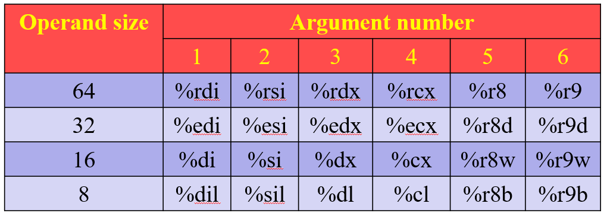

这篇笔记介绍lecture9-10，关于汇编中的函数与数组。  

## 函数

在函数实现中，包含许多处理

- 调用函数
- 返回
- 传递数据
- 寄存器
- 局部变量

### 函数调用

调用函数使用 ``call`` 指令。  

```x86asm
call label    # direct
call *operand # indirect
```

``call`` 指令会将返回地址存入栈中，并跳到函数的代码段。具体地，会将 ``%rsp`` 的值降低（push）， ``%rip`` 的值会被改为函数代码的位置。  

### 返回

返回使用 ``ret`` （已在ICS 03中提到）。

与 ``call`` 类似， ``ret`` 会增加 ``%rsp`` 的值（pop），将 ``%rip`` 改为原来的下一条指令地址。  

### 栈帧结构

栈帧结构指为程序分配的栈部分， ``%rsp`` 指针指向栈顶。  

  

在调用函数时，会先将返回地址入栈，然后执行函数，入栈所需量。函数结束后，出栈直到执行函数之前的位置。  

### 传输数据

根据参数的大小，有特定的寄存器储存参数。返回值一般保存在 ``%rax`` 中。  



在参数多于六个的时候，参数会被储存在栈中，返回地址之前。其中第n个参数在最上面，第7个参数在栈顶（与返回地址相邻）。另外，所有数据大小都向上取整为8的倍数。    

```C
void proc(long a1, long *a1p,
int a2, long *a2p,
short a3, short *a3p,
char a4, char *a4p)
{
    *a1p += a1;
    *a2p += a2;
    *a3p += a3;
    *a4p += a4;
}
```

```x86asm
proc:
    movq   16(%rsp), %rax
    addq   %rdi, (%rsi)
    addl   %edx, (%rcx)
    addw   %r8w, (%r9)
    movl   8(%rsp), %edx
    addb   %dl, (%rax)
    ret
```

### 寄存器使用约定

对于某个寄存器，只允许一个函数活动。在调用函数前，需要保存使用的寄存器值。另外，在寄存器分配和保存时，只需考虑实际使用的寄存器。  

寄存器分为被调用者保存的寄存器和被被调用者保存的寄存器。  

调用者保存的寄存器有  

```x86asm
%rax, %rdi, %rsi, %rdx, %rcx, %r8, %r9, %r10, %r11
```

被调用的函数可以随意使用这些寄存器。函数结束后，如果还需要使用这些寄存器，需要还原调用函数之前的值。寄存器的原值存储在调用者的栈之后，第7-n个参数之前（即调用函数相关的内容中，寄存器原值存储在栈最底端）。  

被调用者（被调用的函数）保存的寄存器有  

```x86asm
%rbx, %rbp, %r12-15
```

类似地，调用者可以随意使用这些寄存器。被调用者使用之前要将原值存储，函数结束后返回。这些原值存储在返回地址的下面（相对而言是栈的上方）。  

例如对于

```C
long P(long x, long y)
{
    long u = Q(x);
    long v = Q(x);
    return u + v;
}
```

对应汇编为  

```x86asm
P:
    pushq  %rbp
    pushq  %rbx        # save %rbp & %rbx
    subq   $8, %rsp
    movq   %rdi, %rbp
    movq   %rsi, %rbx  # save x & y
    call Q
    movq   %rax, %rbx
    movq   %rbp, %rdi
    call Q
    addq   %rbx, %rax
    addq   $8, %rsp
    popq   %rbx
    popq   %rbp
    ret
```

### 局部变量

局部变量被储存在栈中。考虑到寄存器数量有限、可能需要存储数据结构、需要地址等原因，局部变量不会存储在寄存器里，而是存储在栈中，寄存器的下方（栈顶）。使用局部变量的时候，计算它们和 ``%rsp`` 的相对位置。  

### 函数总结

调用函数时，操作如下：  

- 存储调用者负责的寄存器（ ``%eax`` 等）
- 存储剩余参数（7-n）
- 传递前6个参数
- 存储返回地址
- 调用函数
- 存储函数负责的寄存器
- 为局部变量分配空间

返回时操作如下：  

- 将返回值存储在 ``%rax``
- 释放局部变量获得的空间
- 恢复函数储存的寄存器
- 执行 ``ret`` ，将返回地址出栈

可以看到这一套流程之后，参数7-n与调用者负责的寄存器仍在栈中。  

### 递归

对于递归函数，将这部分的内容与上一篇笔记的 ``jmp`` 结合。  

对于这个递归函数

```C
long rfact(long n)
{
    long result;
    if (n <= 1) {
        result = 1;
    } else {
        result = n * rfact(n - 1);
    }
    return result;
}
```

对应汇编为

```x86asm
rfact:				
    pushq  %rbx
    movq   %rdi, %rbx
    movl   $1, %eax
    cmpq   $1, %rdi
    jle    .L35
    leaq   -1(%rdi), %rdi
    call   rfact
    imulq  %rbx, %rax
.L35
    popq 	%rbx
    ret
```

## 数组

### 数组与指针

```C
T A[N];
```

数组声明语句分配了一块大小为 ``sizeof(T) * N`` 的空间。数组的首地址为 ``Xa`` ，是指向数组第一个数的指针， 也是 ``A`` 的值。数组的下标从 ``0`` 到 ``N - 1`` ，其中第 ``i`` 个元素的地址是 ``Xa + i * sizeof(T)`` 。指针加下标得到另一个指针；两个指针相减得到一个正数（例子中为 ``long`` ）。  

在汇编中，若 ``A`` 的值存在 ``%rdx`` 中，下标 ``i`` 存在 ``%rcx`` 中，则数组 ``A[i]`` 的值在 ``(%rdx, %rcx, 4)`` 。  

  

### 多维数组

  

如图，多维数组也是像一位数组一样存储的。元素 ``A[i][j]`` 存储在 ``Xd + sizeof(T) * (C * i + j)`` ， ``C`` 是列数。  

若 ``%rdi`` 存储 ``Xd`` ， ``%rsi`` 存储 ``i`` ， ``%rdx`` 存储 ``j`` ，则 ``A[i][j]`` 为  

```x86asm
leaq (%rsi, %rsi, 2), %rax
leaq (%rdi, %rax, 4), %rax
(%rdx, %rax, 4)
```

### 固定长度数组

```C
#define N 16
typedef int fix_matrix[N][N];

/* Compute i,k of fixed matrix product */
int fix_prod_ele(fix_matrix A, fix_matrix B, long i, long k)
{
    long j;
    int result = 0;

    for (j = 0; j < N; j++)
        result += A[i][j] * B[j][k];

    return result;
}
```

会被改写为  

```C
/* Compute i,k of fixed matrix product */
int fix_prod_ele_opt(fix_matrix A, fix_matrix B, long i, long k)
{
    int *Aptr = &A[i][0], *Bptr = &B[0][k];
    int *Bend = &B[N][k]; 
    int result = 0;
    do {
        result += *Aptr * *Bptr;
        Aptr ++;
        Bptr += N;
    } while (Bptr != Bend)
    return result;
}
```

汇编为  

```x86asm
A in %rdi, B in %rsi, i in %rdx, k in %rcx
fix_prod_ele:
    salq 	$6, %rdx
    addq 	%rdx, %rdi
    leaq 	(%rsi,%rcx,4), %rcx
    leaq 	1024(%rcx), %rsi
    movl 	$0, %eax
.L7:
    movl	(%rdi), %edx
    imull 	(%rcx), %edx
    addl 	%edx, %eax
    addq 	$4, %rdi
    addq 	$64, %rcx
    cmpq 	%rsi, %rcx
    jne		.L7
    rep;
```

### 不固定长度数组

```C
int var_ele(long n, int A[n][n], long i, long j)
  {
      return A[i][j];
  }
```

数组的长度会在定义时根据变量确定。  

```x86asm
n at %rdi, A at %rsi, i at %rdx, j at %rcx
var_ele:
  imulq %rdx, %rd
  leaq  (%rsi,%rdi,4), %rax
  movl  (%rax,%rcx,4), %eax
```