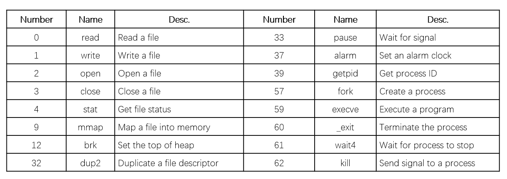

这篇笔记介绍lecture13与lecture17中nonlocal jump的内容。

## 操作系统

操作系统是管理计算机硬件的程序，也为应用程序提供基础。CPU和内存由系统分配并提供给应用程序直接使用。应用程序要利用操作系统才能与硬件交互。

操作系统提供进程、虚拟内存、文件等抽象。  

.png)

### 进程

当某个程序在操作系统中运行时，操作系统会让程序认为它是唯一在运行的程序；程序可以独占所有处理器、内存和输入输出。

进程是运行程序的一个“实例”。所有程序都在某个进程的上下文中运行。进程分为用户部分和操作系统两部分，操作系统部分也称为内核，被所有进程共享（相同）。

内核下的进程可以执行指令集中的任何指令，也可以访问系统的任何内存位置。用户模式下的进程不能执行特权指令，也不能直接引用内核的代码和数据，但可以通过接口间接操作。  

一般来说，模式被存储在某个寄存器的某些位中。如果这些位被设置，则处于内核模式，否之处于用户模式。

### 虚拟内存

虚拟地址空间包括程序代码和数据（包括全局变量）、堆、共享库、栈、和内核五个部分。硬件可以理解虚拟地址。每个进程都有独自的地址空间。  

.png)  

### 文件

普通文件是字节序列。  

输入和输出设备也被模拟为文件。在Unix I/O中，系统所有输入和输出都通过I/O来执行，用一组小型系统调用来读写文件。

## 异常控制流

应用程序最初都在用户模式下运行。要转换模式，需要 ``syscall`` 或 ``sysret`` 指令。  

### 系统调用

指令 ``syscall`` 或 ``sysret`` 为硬件机制。它们是用户和操作系统间过程的接口，可以控制对内核服务的访问。调用 ``syscall`` 会进入内核模式，执行相应的系统指令；然后执行 ``sysret`` ，回到用户模式中 ``syscall`` 下一条语句的位置。  



```C
int main()
{
    write(1, "hello, world\n", 13);
    _exit(0);
}
```

这段代码的汇编如下  

```x86asm
    .section .data
    string:
        .ascii "hello world\n"
    string_end:
        .equ len, string_end - string
    .section .text
    .global main
main:
    movq  $1, %rax
    movq  $1, %rdi
    movq  $string, %rsi
    movq  $len, %rdx
    syscall
    movq  $60, %rax
    movq  $0, %rdi
    syscall
```

在这段代码中， ``write`` 和 ``_exit`` 为系统调用。 ``movq $1, %rax`` 传输了系统调用编号。  

两个模式之间可以最多传输六个参数。这六个参数通过 ``%rdi`` ``%rsi`` ``%rdx`` ``%r10`` ``%r9`` ``%r8`` 六个寄存器传递。调用者使用的寄存器要在 ``syscall`` 前存储，其中 ``%rcx`` 和 ``%r11`` 寄存器会被销毁，用于存储当前（系统调用前） ``%rip`` 和 ``%rflags`` 。按照约定，调用的系统命令号和返回的整数都存储在 ``%rax`` 中。  

*使用%rax是软件约定，而%rcx和%r11为硬件约定。*

其中， ``%rflags`` 有IF（中断标志）和TF（陷阱标志）。中断标志决定CPU是否响应可中断标志。陷阱标志启用时，每执行一条指令都会产生一个调试异常，可以用于调试，允许单步执行。

### 异常

处理器状态标志在处理器内部各种状态中。事件指处理器状态的明显变化（系统调用指令结果、磁盘或网络数据到达、除以零等指令），异常指在应对某些事件时，硬件将控制权移交给内核的某个位置,不会继续执行用户态的下一条指令。触发异常的事件可能与当前指令有关也可能无关。例如 ``syscall`` 、page fault为有关事件，时钟到时、IO请求等为无关事件。  

处理异常的代码为exceptional handler。在处理完事件后，它有以下几种选择：  

- 回到原来用户态的当前指令
- 回到用户态的下一条指令（ ``syscall`` ）
- 终止终端的程序（例如除0）

异常有很多种类，每种在异常表中对应一个编号。只需要编号和exception table的起始地址，操作系统就可以跳转到相应exceptional handler的起始地址。  

  

异常处理器在内核态下运行，它们有充分的权限。此外，异常发生时，CPU会将相关的重要信息移动到内核的栈上（例如返回地址、RFLAGS、RSP等）。这个操作在 ``syscall`` 的时候不需要。  

异常可以分为同步异常和异步异常。

### 同步异常

同步异常指当前执行的指令导致了事件发生。可以分为 ``traps`` 、 ``faults`` 、 ``aborts`` 。  

``traps`` 是主动执行的（如 ``syscall`` ），返回时回到原来指令的下一条。 ``faults`` 是无意引起的，但是很可能可以恢复，会返回到原来指令（重新执行，如page faults，可以实现按需加载）或终止（如protection faults）。 ``aborts`` 是无意引起并且不可恢复的（例如parity error、machine check），会终止当前的程序。

以下是两个错误例子。  

```C
int a[1000];
main()
{
    a[500] = 13;
}
```

在执行 ``a[500] = 13`` 时， ``a[500]`` 可能还未被分配，会导致page fault。然后系统创建相应page并导入内存，回到指令位置，并重新执行。  

```C
int a[1000];
main()
{
    a[5000] = 13;
}
```

这段代码会触发同样的page fault，而page fault handler会发现 ``a[5000]`` 是一个无效地址，给用户处理器发送SIGSEG信号导致其退出。  

在x86-64系统中有以下的异常表。


### 异步异常

异步异常又名中断，与当前运行的指令完全无关。在x86系统中，中断出现时，会先将当前指令执行完毕，处理中断，回到下一条指令继续。  

中断包含IO（与外部设备相关）、重启等。IO设备可以通过给芯片上的某个引脚发信号来触发中断。CPU会打断当前的操作并转移到handler。  