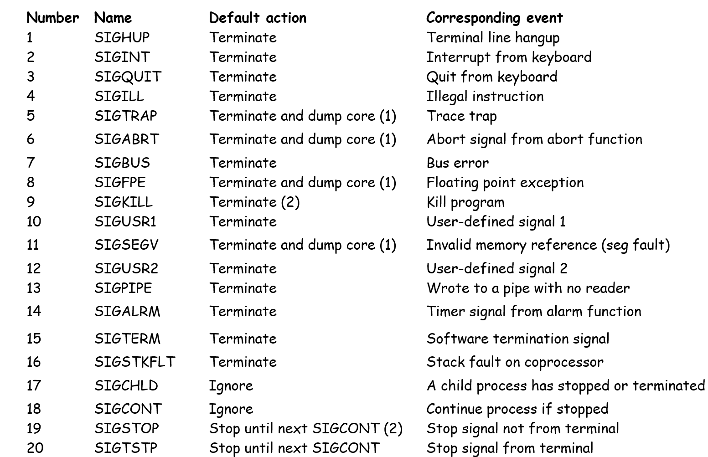

这篇笔记介绍lecture16、17中的内容。  

### 进程组

每个进程都属于且仅属于一个进程组。进程组编号由一个正整数（process group ID）标记。默认情况下，子进程与父进程有相同的进程组。  

```C
// return process group PID
pid_t getpgrp(void);
```

``getpgrp()`` 函数获取进程的进程组PID。

```C
// return 0 on success, -1 on error
pid_t setpgid(pid_t pid, pid_t pgid);
```

``setpgid()`` 函数更改 ``pid`` 进程的进程组PID为 ``pgid`` 。如果 ``pid`` 为0，则使用当前进程的PID；如果 ``pgid`` 为0，则由 ``pid`` 指定的进程PID为 ``pgid`` 。  

作业（job）是unix shell使用的抽象，用于表示进程，作为评估单个命令行的结果而创建的进程。任何时候最多有一个前台作业和零或多个后台作业。shell会为每个作业创建一个单独的进程组（进程组ID通常取自作业中一个父进程）。  


## 信号

信号是一种消息，通知操作系统某种类型的事件发生。这里的类型对应某种系统事件。系统事件分为硬件事件和软件事件。  

  

要将信号传递给目标进程，需要发送信号、接受信号两个步骤。  

通过更新目标进程上下文中的某些state，内核向目标进程发送信号。有两种情况会导致发送信号：内核检测到系统事件，或进程调用了一个 ``kill`` 函数。  

```C
// pid - receiver process, sig - signal
// 0 if OK, -1 on error
int kill(pid_t pid, int sig);
```

内核会迫使目标进程对信号做出反应。进程可以忽略信号、终止，或者通过一个用户级别的名为信号处理器的程序捕获信号。  

待处理信号（pending signal）指已发送但尚未接收的信号。任何时候，每个类型最多只有一个待处理信号。如果某个进程已经有了类型k的待处理信号，接下来发送到进程的类型k信号会被简单地丢弃。   

进程可以选择性地阻止某些信号。被阻止的信号可以发送到目标进程，但在阻塞解除之前，这些待处理信号不会被接受。  

对于每个进程，内核在待处理位向量（pending bit vector）中维护待处理信号，在阻塞位向量（blocked bit vector）中维护阻塞信号。在发送类型k的信号时，内核设置类型k的位；在接受类型k的信号时，内核清除类型k的位。

### 发送信号

对于 ``kill()`` 函数，如果 ``pid`` 大于0，函数向 ``pid`` 进程发送信号；否则，向进程组 ``abs(pid)`` 发送信号。  

```C
int main()
{
    pid_t pid;

    /* child sleeps until SIGKILL signal received */
    if ((pid = Fork()) == 0) {
        Pause(); /* wait for a signal to arrive */
        printf("control should never reach here!\n");
        exit(0);
    }

    /* parent sends a SIGKILL signal to a child */
    Kill(pid, SIGKILL);
    exit(0);
}
```

``kill()`` 可以向进程组发送信号。将参数 ``pid`` 改为 ``-pid`` ，会将信号发送到PID进程组中的每个进程。

除了 ``kill()`` 之外，还有其它方式发送信号，如 ``alarm()`` 函数。  

```C
// return the remaining secs of last alarm, or 0 if no previous alarm
unsigned int alarm(unsigned int secs);
```

``alarm()`` 函数安排内核在 ``secs`` 秒后向调用进程发送SIGALRM信号。如果 ``secs`` 为0，则不产生新的闹钟。这个函数会取消任何待处理闹钟，返回待处理闹钟的剩余秒数。

还可以通过键盘发送信号。CTRL-c会让内核向shell发送SIGINT信号。shell接收这个信号，然后向前台所有进程组中的所有进程发送SIGINT，默认终止前台作业。CTRL-z会让内核向shell发送SIGTSTP信号，shell接收并向前台所有进程组发SIGTSTP，默认停止（挂起）前台作业。  

### 接收信号

接收信号的先决条件是内核准备将控制交给进程。  

接收信号时，内核检查检查未阻塞的待处理信号集合。如果这个集合为空，内核将控制权交给进程的下一个指令；如果集合非空，内核选择集合中某个信号k（通常为最小k）并强制进程接收信号k。信号的接收触发进程的某些动作。进程完成动作后，控制到达进程的下一个指令。  

每个信号类型都有一个预定义的默认动作，例如终止、停止、被忽略等等。SIGKILL信号的默认动作是终止进程，SIGCHLD信号的默认动作是忽略信号。通过 ``signal()`` 函数，进程可以改变信号的默认动作。SIGKILL和SIGCHLD的默认动作无法改变。  

```C
typedef void handler_t(int);
handler_t *signal(int signum, handler_t *handler);
```

如果 ``handler`` 为SIG_IGN， ``signum`` 类型的信号会被忽略；如果 ``handler`` 为SIG_DFL， ``signum`` 类型的信号恢复到默认动作；否则将 ``signum`` 类型的动作改变为 ``handler`` 。  

实际使用时，程序会先设置 ``handler`` 的行为，通过 ``signal`` 函数的调用接收信号，通过它的执行处理信号。  

```C
void handler(int sig) /* SIGINT handler */
{
        printf("Caught SIGINT\n");
        exit(0);
}

int main()
{
    /* Install the SIGINT handler */
    if (signal(SIGINT, handler) == SIG_ERR)
        unix_error("signal error");

    pause(); /* wait for the receipt of a signal */

    exit(0);
}
```

当进程捕捉到类型 ``k`` 的信号时，为这个类型设计的handler会被调用。同样的handler可以处理不同类型的信号，这种情况下类型信号会作为参数传递给handler函数（用户态）。当handler执行返回语句的时候，控制通常会回到之前的部分（被接收信号打断的部分，内核调用），也有可能由于错误立即返回。只有函数执行结束回到内核态，才会将待处理位向量中的值清除。

  

### 阻塞与取消阻塞信号

在执行signal handler时，还可能收到其它的信号。  

内核态会隐式地阻塞信号，即阻塞任何正在被handler处理的同类型信号。通过 ``sigprocmask`` 系列函数可以显示地处理信号。  

```C
#include<signal.h>
int sigprocmask(int how, const sigset_t *set, sigset_t *oldset)
```

这个函数可以设置被阻塞信号的集合。参数 ``how`` 为SIG_BLOCK时，将 ``set`` 添加到被阻塞的集合；为SIG_UNBLOCK时，将 ``set`` 从被阻塞集合移除；为SIG_SETMASK时，直接将被阻塞集合设置为 ``set`` 。如果 ``old_set`` 非空，先前被阻塞的集合存储在 ``old_set`` 中。  

除了 ``sigprocmask`` 外还有一些其它的函数，用于设置 ``set``。  

```C
int sigemptyset(sigset_t *set);
int sigefillset(sigset_t *set);
int sigaddset(sigset_t *set, int signum);
int sigdelset(sigset_t *set, int signum);
// return 0 if OK, -1 on error
int sigismember(const sigset_t *set, int signum);
// 1 if member, 0 if not, -1 on error
```

## 并行错误

### 指导原则

有一些方法可以尽可能减少并行错误。  

- 让信号handler尽量简单，比如设置一个值就直接返回。可以让相关的函数周期性检查这个值。  
- 只使用异步信号安全的函数（ ``printf`` 、 ``sprintf`` 、 ``malloc`` 、 ``exit`` 都不符合要求），这些函数的中断不会干扰操作。CSAPP库中有相关的函数替代这些函数的功能（ ``write`` 、 ``_exit`` 是安全的）。  
- 有些函数可能改变错误码。在产生错误码时要及时保存（防止被覆盖或产生其它问题）。
- 通过阻塞所有信号来保护对共享全局数据的访问。  
- 用 ``volatile`` 声明全局变量，不要将其放入寄存器。 ``volatile`` 会保证变量存放在一个稳定的地址。  
- 用 ``sig_automic_t`` 声明标志，保证原子操作。 ``flag++`` 或 ``flag += 10`` 等操作是复合操作。  

### 信号处理语义

``read`` 、 ``write`` 、 ``wait`` 、 ``accept`` 等是慢系统调用，可能会潜在地阻塞系统很长时间；一些旧的Unix系统会在某种信号被捕获后将它的动作恢复为默认值，或者在慢系统调用中，被中断后不会回到中断的位置，而是立即返回给用户。

### 自旋循环

当线程尝试获取被占用的锁时，它会在循环中不断检查锁的状态，直到锁变为可用。  

```C
volatile sig_atomic_t pid;

void sigchld_handler(int s)
{
    int olderrno = errno;
    pid = waitpid(-1, NULL, 0);
    errno = olderrno;
}

void sigint_handler(int s) {}

int main(int argc, char **argv)
{
    sigset_t mask, prev;

    Signal(SIGCHLD, sigchld_handler);
    Signal(SIGINT, sigint_handler);
    Sigemptyset(&mask);
    Sigaddset(&mask, SIGCHLD);

    while (1) {
        Sigprocmask(SIG_BLOCK, &mask, &prev); /* Block SIGCHLD */
        if (Fork() == 0) /* Child */
    	    exit(0);
        /* Parent */
        pid = 0;
        Sigprocmask(SIG_SETMASK, &prev, NULL);/* Unblock SIGCHLD */
        /* Wait for SIGCHLD to be received (wasteful) */
        while (!pid)
            ;
        /* Do some work after receiving SIGCHLD */
        printf(".");
    }
    exit(0);
}
```

这里的 ``while (!pid) ;`` 浪费资源。可以将 ``;`` 换成 ``pause();`` 。这里不能去除循环，因为 ``pause()`` 可能被SIGINT等中断。但是，如果SIGCHLD在 ``while`` 之后、 ``pause()`` 之前到达，会导致父进程一直处在 ``pause()`` 中。  

用 ``sleep(1)`` 替换 ``pause()`` 会解决竞争问题，但是如果信号在 ``while`` 和 ``sleep`` 之间到达，程序必须等待 ``sleep`` 时间结束才能继续。使用其它睡眠函数也没有意义。睡眠时间太短会导致循环浪费资源，太长会导致程序太慢。  

可以用 ``signalsuspend`` 函数来处理自旋循环。  

```C
int signalsuspend(const sigset_t *mask);
```

这个函数相当于  

```C
sigprocmask(SIG_SETMASK, &mask, &prev);
pause();
sigprocmask(SIG_SETMASK, &prev, NULL);
```

但保证前两行同时发生，不会被中断。具体来说，这个函数暂时改变当前被阻塞的信号集，等待信号发生。如果信号发生后的动作是终止，就立即终止，否则在handler返回后返回，并恢复调用时的阻塞集状态。将 ``pause()`` 或 ``sleep(1)`` 改为 ``signalsuspend(&prev)`` 就能解决自旋循环的问题。