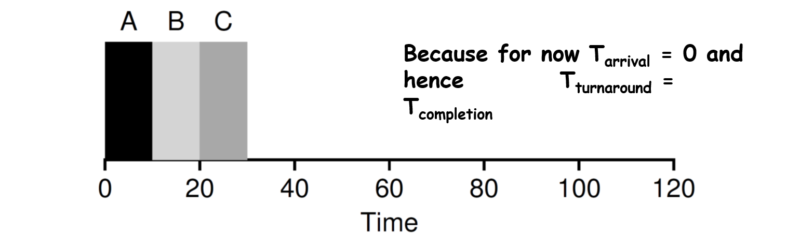
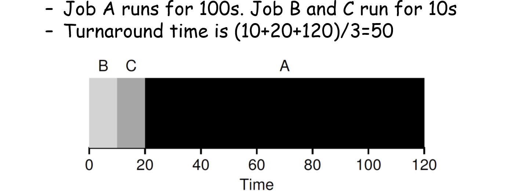
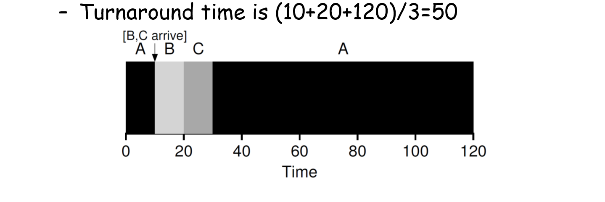

这篇笔记介绍lecture19，Process Scheduling的内容。  

## 概述

### 机制与策略

机制（mechanism）指实现某种功能的思想，例如上下文切换。策略（policy）位于机制之上，指做出某种决策的算法，例如这篇笔记中介绍的调度策略。  

### 周转时间

周转时间（turnaround time）是衡量调度策略的指标（metric）。
它指任务完成的时间减去任务到达的时间，即  

$$
T_{turnaround} = T_{completion} - T_{arrival}
$$

### 响应时间

响应时间（respond time）是另一个评价指标。响应时间指任务第一次被调度的时间减去任务到达的时间。  

$$
T_{respond} = T_{firstturn} - T_{arrival}
$$

## 调度算法

### FIFO

FIFO（first in, first out）策略也称为FCFS（first come, first serve）。这个策略指哪个任务先到，就先执行哪个任务，并且一直执行到这个任务结束。  

  

这个策略会导致排队问题。如果有一个长任务在执行，会导致后面的任务排队，降低系统的吞吐量（单位时间内系统完成的任务数量）。  

### SJF

SJF（shortest job first）是对FIFO的改进。顾名思义，它会先执行时间最短的任务，并执行到任务结束。  

  

然而，如果任务A在0时刻到达，B、C在10时刻到达，就会导致和FIFO一样的问题。  

### STCF

STCF指shortest time-to-complete first。在每次任务到达的时候，系统会选择需要完成的时间最短的任务，并切换到这个任务执行。  

  

要实现STCF，操作系统需要闹钟，定期查看是否有任务到达。  

STCF可能导致的问题是，如果一直有所需时间较短的任务到达，时间较长的任务就会一直无法执行。  

### Round Rabin

round rabin（RR）会维护一个运行队列。对于运行队列中的每个任务，系统运行一个时间片，然后切换到下一个任务，直到队列为空。时间片必须是定时器终端周期（10ms）的倍数。  

  

round rabin的问题是它会发生多次切换，需要不断地切换、存储和恢复上下文，会导致浪费时间，并对TLB和CPU pipelines（在以后的笔记中介绍）造成影响。所以需要设置恰当的时间片。时间片太短会造成上述的影响，太长会导致round rabin近似退化为FIFO。  

对比STCF和round rabin，STCF有更优的周转时间，但round rabin有更优的响应时间。  

## 引入IO

以上的调度策略都假设任务只使用了CPU。现在引入需要IO的情况。  

在下面这张图中，先执行A再执行B，而A中有四个IO操作。在A进行IO操作时，CPU是空闲的。  

  

在任务发送IO请求的时候，会触发一个系统调用，这个任务会被内核阻塞，CPU开始调度另一个任务。当IO结束的时候，CPU被中断，任务回到可以执行的状态，由CPU决定接下来执行哪个任务。  

  

## MLFQ

以上所有情况都假设系统知道每个任务执行需要的时间。然而实际情况下任务所需要的时间是未知的。要处理这个问题，需要MLFQ（多级反馈队列调度器，multi-level feedback queue scheduler）。

### 介绍

MLFQ可以在不知道任务所需时间的情况下，同时优化周转时间和响应时间。调度器会学习任务在之前运行中所表现出的特征，并以此来优化调度决定。许多系统都把MLFQ作为基础的任务调度器。  

### 规则

任务有interactive job，需要用户操作并且通常运行时间短；也有CPU-bound job，需要很长的CPU运行时间。前者的响应时间很重要，但后者的响应时间相对不太重要。

MLFQ维护数个队列，每个队列属于不同优先级。同一个队列中存储优先级相同的任务。如果任务A的优先级高于任务B，运行A；如果优先级相同，用RR的策略运行这两个任务。在新任务到达时，先给它最高优先级。如果这个新任务将整个时间片用完，则推测它是low-bound job，降低它的优先级，否则留在同一个优先级。注意涉及到IO时，执行IO的任务会被阻塞，MLFQ认为它没有用完时间片，会将其保留在高优先级。  

  

上面的策略可能会导致一些问题。第一个问题是starvation，如果系统中有很多interactive job，会导致和STCF类似的问题。第二个问题是gaming scheduler attack，如果某个任务每次都在时间片快结束（但是还没有结束）是进行IO操作，它会一直被保留在最高优先级，几乎独占CPU。第三个问题是程序可能会改变它的行为。  

解决方案是增加一条规则。在某些时间（周期S）后，将所有任务移入最高优先级队列（priority boost）。此外，为了避免第二种问题，可以将原来的规则改为如果某个任务使用的时间超过了时间片的一部分比例（而不是用完），就下降它的优先级。

MLFQ需要许多参数，队列数、时间片等。设置合适的参数是比较复杂的。  

许多MLFQ会为不同优先级的任务赋予不同的时间片，优先级高的时间片更短。MLFQ会引入VOO-DOO常量，应该尽可能地避免它们，但是这很难做到。