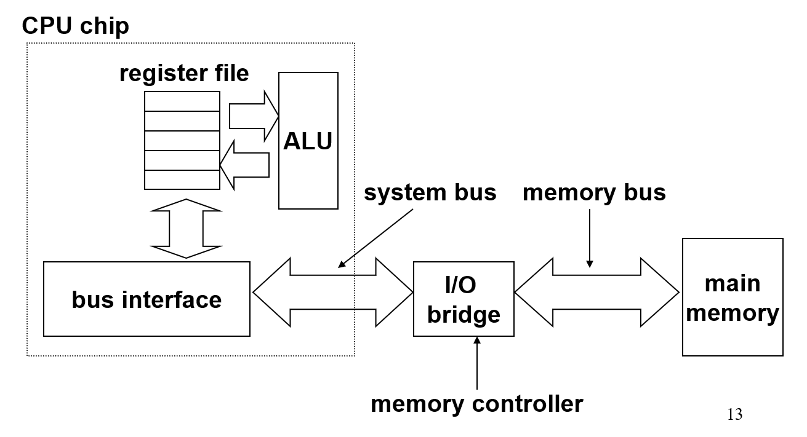
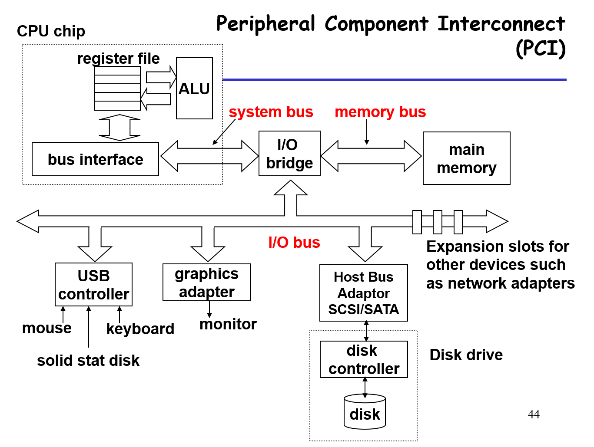

## 随机访问内存（RAM）

### 内存

RAM分为动态和静态。

  

SRAM和DRAM都是“易丢失的”（volatile）内存。持久化的内存称为ROM，是只读的，在断电后不会丢失。另一种持久化内容叫firmware。

连接各个地方的硬件称为总线（bus），可以传输地址、数据、信号等。总线被大量设备共享。

  

### 磁盘

磁盘的两面各分为数个磁道（track），每个磁道分为数个块（sector）；总磁盘可以由数张磁盘叠在一起。所以，磁盘的容量等于每个道的块数量 $\times$ 每个盘的道数量 $\times$ 磁盘面数 $\times$ 磁盘数。

读取磁盘数据时，需要经过调整到正确的磁道、等待磁盘旋转、读取三个步骤。即，$T_{access} = T_{avg~seek} + T_{avg~rotation} + T_{avg~transfer}$ 。时间主要消耗在前两个部分，所以尽量顺序地读写可以显著提高效率。

  

读写磁盘是一个异步事件。CPU通过I/O接口向磁盘发送命令，磁盘通过DMA将数据放入内存（不通知CPU），然后向CPU发送中断信号。

### SSD

SSD是一种更接近内存的持久化存储方式。

SSD由数个blocks组成，每个block包含数个pages。只有擦除整个block（除非目标page为空），才能在page写入数据；block数据等可能被移动。Flash transaction layer用来记录相关的映射信息。每个block只能支持一定次数的写操作，一般会尽量平均地使用各个block。顺序读写要比随机读快；随机写会稍微更慢一点。

## 局部性

经常访问的数据应该被放到容量更小、速度更快的位置。局部性指，程序倾向于使用与刚刚被使用过的资源地址相同或相近位置的资源。

### 时间局部性

时间局部性指短时间内访问过的数据更可能被再次访问，例如循环中的代码大概率会被执行多次。

### 空间局部性

空间局部性指访问过某个数据后，其附近的数据有更高的概率被访问。例如，很多时候会顺序地访问数组中的每个元素。

### 内存金字塔

  

广义来说，可以认为第i层是第i+1层的缓存。

从第i层取数据时，如果数据存在则返回，称为cache hit；否则称为cache miss，将数据搬到第i层（可能与某个数据替换），并从第i层读取。

cache miss包含cold miss、capacity miss和conflict miss。cold miss指当前缓存为空。capacity miss指cache已满。conflict miss指两块相关联的cache中，在有空间的情况下出现了互相替换的情况（缓存空间足够大，但不同地址被映射到了同一缓存处）。

memory hierarchy的设计基于以下理念：第i层的数据比第i+1层的数据有更大概率被访问。

## 缓存

缓存封装在SRAM中，位于寄存器和内存（DRAM）之间。

cache由数个set组成，每个set由数条line组成。line中的数据只能放在固定的set中（与硬件有关）。line中存放元数据和数个block的真正的缓存数据。元数据中包含valid和tag（地址的一部分，用于匹配）。

### 读取策略

set数为 $S$ ，索引称为index，每个set中的line数为 $E$ ，block数量为 $B$ ，索引称为offset，物理地址位数为 $m$ 。在这种情况下，索引到set需要的位数为 $s = log_2^S$ ，索引到block需要的位数为 $b = log_2^B$ ，此时tag的位数为 $t = m - (s + b)$ 。不包括元数据的缓存大小为 $S \times E \times B$ 。将某个物理地址存入缓存时，会根据缓存地址的大小，将物理地址转换为对应的tag、index和offset。

set和block的位置需要记录，但line不需要，因为数据可以放在其set的任意一条line中，寻找时一一匹配。根据set中line的数量，有三种设计模式：direct-mapped cache、set associative cache和fully associative cache。

direct-mapped cache中，每个set只有一条line。地址中的index可以放在前面也可以放在中间；放在前面时，更容易导致临近的地址被映射到同一篇缓存区域，空间局部性差，所以现在index一般放在中间。

现在一般采用set associative cache，每个set中有多条line。此时的效率没有direct-mapped cache高，但是可以减少conflict miss。如果所有line都被填充了，就要选择一条line替换。替换策略概括为两种：LFU（替换被访问最少的）和LRU（上次访问离当前最远的）。

fully associative cache中只有一个set。

### 写入策略

写入同样分为write hit和write miss。

write hit时有两种方式：写穿和写回。写穿指写某个数据时，把i层及以后所有层中的数据都更新；写回指标记被修改的数据（dirty bit），只有第i层数据被替换时，才相应更新更底层（i+1）的数据。  

write miss有write-allocate和no-write-allocate两种策略，分别指将数据放到i层再写和直接在其它层写。写穿一般和no-write-allocate配合；写回和write-allocate配合。现代CPU一般使用后一种方式。

### 性能指标

miss rate指在某层访问不到的比例。hit rate等于1减去miss rate。

局部性更好的程序会表现出更高的性能。