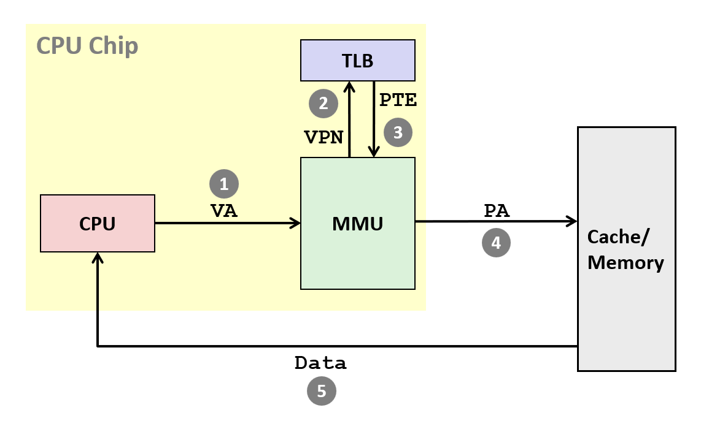

## 虚拟内存

### 访问内存

从零到最大内存空间，代表实际的物理内存位置。物理访问指CPU通过物理地址访问内存。  

虚拟访问指CPU通过虚拟地址访问内存。虚拟地址会被转换为对应的物理地址。转换时涉及到MMU（内存管理单元，是CPU的部件，通过SW进行地址翻译）和SW（内存中的表，被操作系统设置，用于查询）。  

n位地址空间指空间从0到$2^n - 1$。每个物理内存可以有一个物理地址和多个虚拟地址，多个进程可以通过共用物理地址通信。   

使用虚拟内存可以更高效地使用内存，内存被视作了一种缓存，节约内存空间；内存布局和管理会变得简单；操作系统可以将各个进程的物理空间隔离。  

### 分页

虚拟内存和物理内存都会被分为一个个连续的页（大小为$2^p$，通常为4K），分别被称为VP和PP。VP和PP的大小相同，每个地址一一对应。页表中记录了VP到PP的映射，以及这一页是否存在（valid）。

页表数量和进程数相等。操作系统一个寄存器获取页表基地址。  

虚拟内存中分为未分配、缓存、未被缓存三种情况。未分配和未被缓存都会触发page fault，但未被缓存触发后，操作系统会将数据从磁盘搬运到内存，访问可以继续进行。  

翻译成功为page hit（valid位为1），否则为page fault。page fault分为三种情况：第一种情况，所需的数据被放在磁盘中，操作系统将磁盘中的数据搬运到内存（swap in/page in）；第二种情况中，数据本来就位于磁盘，同样需要操作系统搬运数据进行按需搬运（demand paging），或者程序要求了空间但操作系统还未分配（例如堆）；第三种情况是segmentation fault。  

实际处理page fault的过程分为三步。第一步，processer signal controller将磁盘中的数据搬运到内存。第二部，在I/O控制器的管理下，DMA读取内存。第三步，I/O通过信号通知处理器，读取已经完成。  

在某个时间段，程序访问的固定一部分虚拟页称为working set。只要working set小于主内存的总量，局部性就会让系统性能表现得很好，否则就会出现thrashing问题，导致性能下降。  

### 内存管理

虚拟内存可以简化链接和加载，因为对每个进程来说虚拟地址都是独立的，数据、栈、堆等等可以排布在任意位置（比如相同位置）。加载时，为数据段和代码段创建PTE，但是都标为invalid。  

此外，对于连续的虚拟页，操作系统可以分配离散的物理页。在不同时刻，一个虚拟页可以指向不同的物理页。此外，不同的虚拟页也可以指向相同的物理页（例如，所有的共享库可以指向相同的位置）。  

32位机器的PTE为4位，64位机器为8位（与支持的物理地址范围匹配）。

### 内存隔离

在地址、是否有效之外，页表中剩余的位置可以存储权限（读、写、执行）。page fault时，会检查权限，如果权限不足会返回segmentation fault。  

## 地址翻译

### 基本信息

翻译时，CPU核心给出的所有地址均被视作虚拟地址。  

定义一些基本参数：  
$N = 2^n = 虚拟地址上限$  
$M = 2^m = 物理地址上限$  
$P = 2^p = 页大小（单位为字节，通常p = 12， P = 4K）$  

虚拟地址和物理地址都分为虚拟/物理地址数（VPN/PPN）和页偏移（VPO/PPO）两个部分。页偏移均为p位，且翻译过程中不会更改。实际翻译的过程是将VPN翻译为PPN。

页表也存在物理内存中。CR3寄存器中存放物理地址。  

翻译时，后p位不变，在表中找出前n-p位对应的物理地址，填充到m-p位中，就获得完整的物理地址。  

对于page hit的情况，MMU需要访问两次物理内存，分别用于查找页表和查找实际的数据。  

### 缓存

如果通过VA访问缓存，CPU可以直接访问；否则CPU需要将指令交给MMU解析，前者更快。但现在大多数缓存通过PA索引。每个进程的地址空间是独立的，对应不同的页表，切换时如果不清空cache，就会导致cache中的地址仍然是上一个进程的虚拟地址对应的物理地址，所以必须将缓存清空，这个清空过程会产生开销。  

### TLB

TLB是对页表翻译结果的缓存。  

  

TLB分为TLBT（tag）和TLBI（index）两个部分，缓存分为tag（CT）、index（CI）和offset（CO）三个部分。TLB对应虚拟地址数（VPN），缓存对应完整的物理地址。  

  

具体来说，TLBI标识了TLB存在哪一行中，然后遍历这一行，找到对应的tag。如果valid位为1，就说明对应的PN有效，PN和VPP组合得到PA。PA按顺序拆分成tag、index和offset。  

通过cache索引时，遍历的顺序为index->tag->offset。如果在对应的index中找到的tag和地址中的tag相等，且valid位为1，就在对应的offset找到了缓存数据。  

TLBI的位数对应组数。如果TLB共有16个entries，且是4路组相连的，就说明每组有四个数据，即共有16/4 = 4组，TLBI需要2位。  

### 多级页表

每个进程都需要一个独立的页表。如果采用单级页表设计，会导致页表占用了大量内存。而每个页表中可能只有几页用到。  

以二级页表为例。在2级页表中，第一级页表中的每一项指向第二级页表的起始地址，二级页表中指向实际的物理地址。  

现代CPU要求64位地址中，高16位的数字必须全零或全一，有效地址只有48位，且这些高位的值和第48位相等。如果这些位为1，则这部分是内核虚拟地址，否则是用户态虚拟地址。不同进程的内核态虚拟内存内容相同。实际$2^{64}$个地址中，有一部分是非法的。硬件规定每个页表占用一个4K物理页，每个页表项占据8个字节，每个页表页有512个页表项。

多级页表中，TLB中存储的仍然是实际的物理地址。虚拟地址中的虚拟页号部分存储了每一级对应哪个页表项。除最后一级外，页表中存储的地址为下一级页表的起始地址（第一级起始地址存放在CR3中）。每个页表项中的地址都是物理地址。  

若地址共为64位，在四级页表中，48-63位全0/全1，12-47位每部分9位（9位对应512个页表项）存储页表索引，0-11位共12位存储业内偏移。注意2、3...页表均为页表页，每个页表页分配时最少需要4K。对于16K页表来说，最后的第四级页表大小为4K，有512个页表项，业内偏移为12位，则能记录的地址为$512 \times 2 ^ {12} = 2^{21}$。  

### Core i7

Core i7中，支持48位（256T）的虚拟地址空间和52位（6PB）的物理地址空间。兼容性模式支持32位虚拟和物理地址空间。  

### VIPT

VA分为36位的VPN和12位的VPO，对应的PA分为CT、CI和CO。VIPT同时综合了VIVT和PIPT的优点，同时将虚拟地址发送给缓存和MMU。缓存读取到对应的index，然后等待MMU翻译出物理的tag，对应找到数值。  

## Linux实现

### 内存分配概念

Linux通过将虚拟内存和物理内存关联来进行初始化。虚拟内存的初值是物理内存中的内容。虚拟内存可能关联普通的文件，初值为文件内容；也可能关联匿名文件，初值全部为零。例如，堆、栈、.bss关联匿名文件，因为堆、栈可以按需分配，不与实际文件相关联。  

swap file是操作系统分配的一个区域，用来交换内存中更改过的内容。  

按照按需分配的思想，虚拟页创建时就被标记，但只有它真正被使用时，才会实际地与物理页建立关联，即在页表中填写相应的映射。  

执行execve命令时，首先将所有vm结构体和页表释放。然后，为新的程序创建vm和页表（根据代码等的elf），设置初始值、是否能访问等（共享库也是私有的）。最后设置PC（同样存储在elf中），开始执行，Linux会按需进行分页。

### 用户态内存分配

```C
// start是应用程序指定的虚拟起始地址，不一定被系统启用
void *mmap(void *start, int len,
           int prot, int flags, int fd, int offset);
```

使用 ``mmap`` 可以更快地复制文件。在 ``read`` 时，如果文件内容已被缓存，操作系统会创建对应的虚拟内存，将其与另一个物理内存建立连接，再将内存中的内容复制。  

### fork

在复制时，默认不复制物理地址内容，而是让两个虚拟地址指向一个物理地址。在发生写操作时，才会复制改变后的内容。这种设计模式会让fork的性能产生很大的提升。 

## 替换策略

### 基本参数

hit rate指在一定次数的查询中，查到的次数和总数之比。  

如果已知了要访问的所有内存，则一定能据此设计出一个最优解，将不同策略的hit rate和最优解的hit rate比较，则能得出不同策略的优劣。  

### FIFO

换出时，优先唤出最早换入的页。  

这种策略会导致Belady异常。直观上来说，如果可分配的页面数增多，hit rate应该上升；但在FIFO策略中，hit rate有可能反而下降。  

### Random Replacement

随机换出可以带来可以接受的性能。  

### LRU

LRU是least recently used的缩写。它的思想是每次换出最久远使用的页。类似的思路还有LFU，换出使用频率最低的页，但是相对而言LRU更好。但是事实上，LRU无法真正实现，因为使用时间不会被MMU记录，只能实现LRU的近似。  

### 时钟算法

时钟算法的思想是通过access bit模拟寻找最久远的页。  

时钟算法将物理页排布成一圈，从任意一个地址开始。最开始每一块都为空，按顺序将每一块内容放在内存里。在放满时，如果需要换出，时钟遍历物理页，如果access bit为1，将其置为0，然后继续，直到找到access bit为0的位置。  

  

操作系统通过反向映射（reference mapping）记录哪些物理内存被访问。