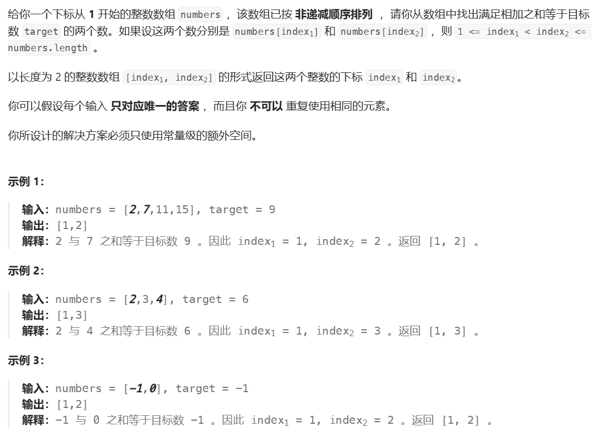
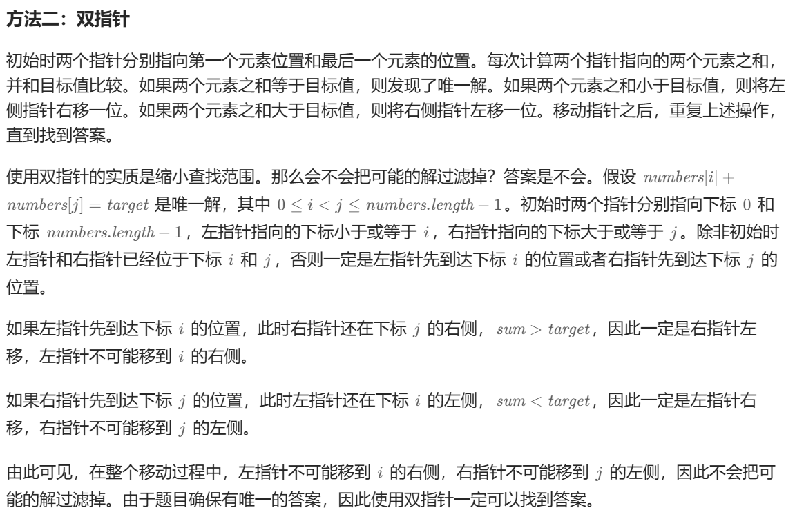
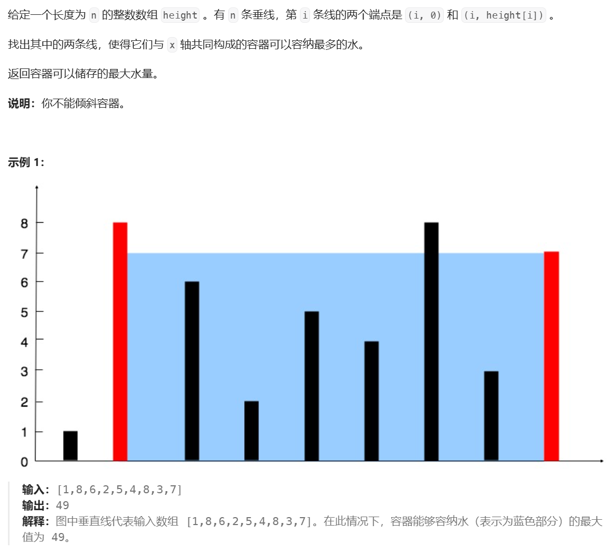
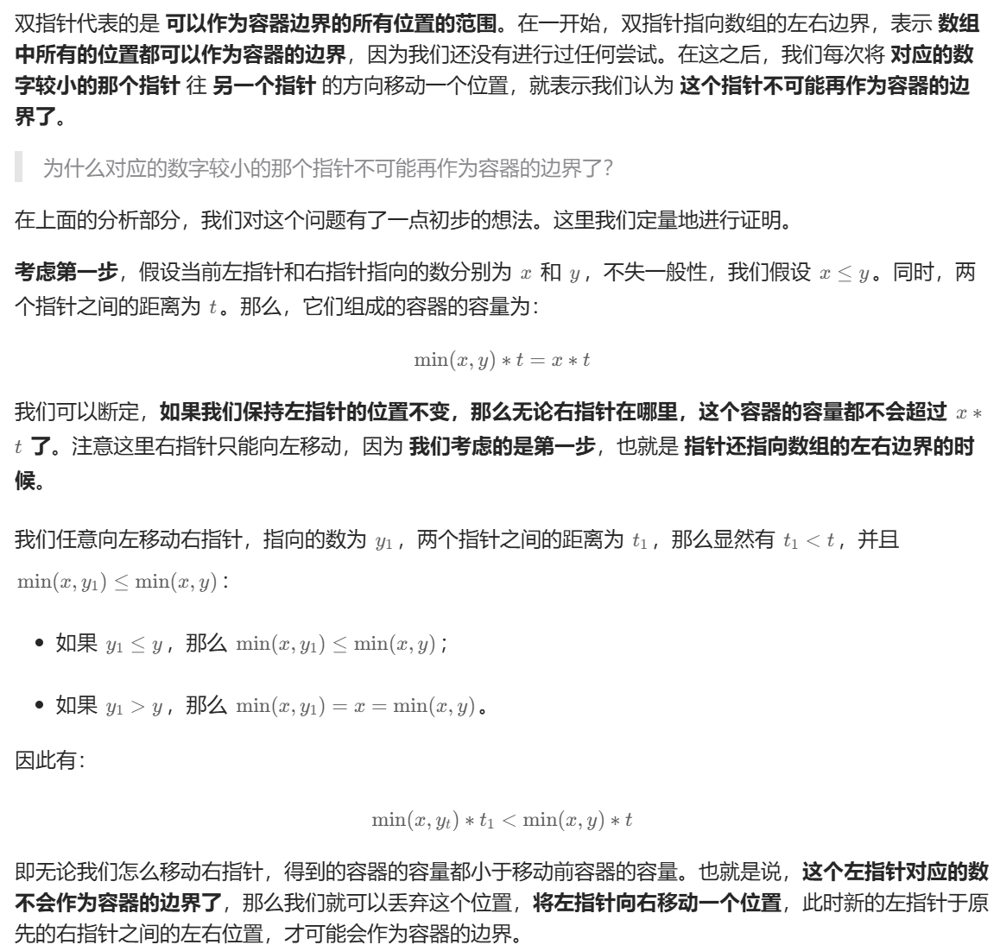
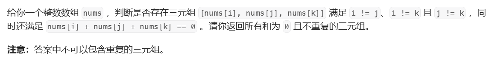

### 125.验证回文串

```Java
s.charAt(i) // 获取字符串字符
Character.isLetterOrDigit(c) // 判断是否是数字/字母
Character.toLowerCase(c) // 小写，非字母不变
```

### 167.两数之和II





```Java
class Solution {
    public int[] twoSum(int[] numbers, int target) {
        int i = 0, j = numbers.length - 1;
        int tmp_target;
        int[] ans = {0, 0};
        while (i < j) {
            tmp_target = numbers[i] + numbers[j];
            if (target == tmp_target) {
                ans[0] = i + 1;
                ans[1] = j + 1;
                break;
            } else if (tmp_target < target) {
                i++;
            } else {
                j--;
            }
        }
        return ans;
    }
}
```

时间复杂度O(n)，两指针最多移动n次。

数组初始化：

```Java
int[] ans = {0, 0};
int[] ans = new int[10];
```

### 11.盛最多水的容器

  

  

可以理解为，对于左右指针分别为i、j且i小于j的情况，当前值是i不变能获取的最大值。  

```Java
class Solution {
    public int maxArea(int[] height) {
        int i = 0, j = height.length - 1;
        int ans = Math.min(height[i], height[j]) * (j - i);
        while (i < j) {
            if (height[i] < height[j]) {
                i++;
            } else  {
                j--;
            }
            ans = Math.max(ans, Math.min(height[i], height[j]) * (j - i));
        }
        return ans;
    }
}
```

使用 ``min`` 和 ``max`` 需要 ``Math`` 库。  

### 15.三数之和

  

不重复指元素，例如 ``nums = [0, 0, 0, 0]`` 返回1。

做法为排序 + 双指针。

```Java
class Solution {
    public List<List<Integer>> threeSum(int[] nums) {
        List<List<Integer>> ans = new ArrayList<List<Integer>>();
        Arrays.sort(nums);
        for (int i = 0; i < nums.length - 2; i++) {
            if (i != 0 && nums[i] == nums[i - 1]) {
                continue;
            }
            int j = i + 1, k = nums.length - 1;
            while (j < k) {
                int sum = nums[i] + nums[j] + nums[k];
                if (sum == 0) {
                    List<Integer> list = new ArrayList<Integer>();
                    list.add(nums[i]);
                    list.add(nums[j]);
                    list.add(nums[k]);
                    ans.add(list);
                    do {
                        j++;
                    } while (j < nums.length && nums[j] == nums[j - 1]);
                    do {
                        k--;
                    } while (k > i && nums[k] == nums[k + 1]);
                } else if (sum > 0) {
                    k--;
                } else {
                    j++;
                }
            }
        }
        return ans;
    }
}
```

```Java
Arrays.sort(nums)
list.add(nums[i]);
List<String> list = new ArrayList<>(); // 初始化
```