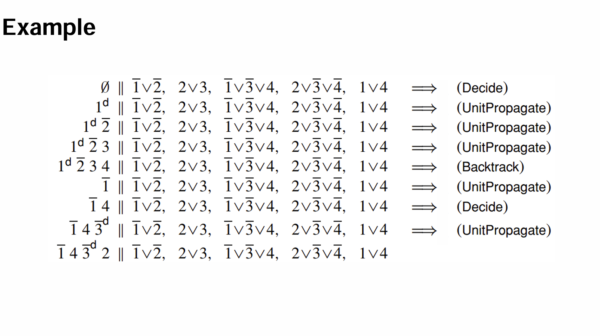

这篇笔记包含lecture4-6，SAT Slover ppt 中的内容。  

*对应教材《数理逻辑与集合论》中1.4、2.6。*  

## 永真式与永假式、可满足性

在任何条件下都为真的命题称为永真式/重言式（tautology），任何条件下都为假的命题称为永假式/矛盾式（contradiction）。 

如果一个命题在某些条件下为真，则这个命题是可满足的。  

按照以上定义，有：  

- 如果 $\neg P$ 是永假式，则 $P$ 是永真式。
- 如果 $\neg P$ 不是永真式，则 $P$ 是可满足的。
- 如果 $P$ 是永假式，则 $P$ 是不可满足的。

## CNF、DNF、PCNF、PDNF

文字（literal）是一个命题变量或者它的否定；一个析取范式（disjunctive clause）是一或多个文字的析取；一个合取范式（conjunctive clause）是一或多个文字的合取。  

| $A$ | $\neg B$| $\neg A \lor B$ | $A \land \neg B$|
|:-:|:-:|:-:|:-:|
|文字|文字|析取式|合取式|

### 析取范式与合取范式

析取范式是合取式的析取，类似地，合取范式是析取式的合取。  

要把一个式子转为析取范式或合取范式，第一种方案可以用真值表，方案与上一篇笔记相同。  

另外一种方式是用公式。要将一个式子转化为析取范式或合取范式，有以下几步：  

- 去掉式子中的蕴含词和双条件词
- 通过摩根律将 $\neg$ 移到括号内
- 使用分配律

以 $(A \land B) \leftrightarrow E$ 为例：  

析取范式：  

$$
\begin{align*}
&(A \land B) \leftrightarrow E
\\= &((A \land B) \land E) \lor (\neg (A \land B) \land \neg E)
\\= &(A \land B \land E) \lor ((\neg A \lor \neg B) \land \neg E)
\\= &(A \land B \land E) \lor (\neg A \land \neg E) \lor (\neg B \land \neg E)
\end{align*}
$$

合取范式：

$$
\begin{align*}
&(A \land B) \leftrightarrow E
\\= &((A \land B) \lor \neg E) \land (\neg (A \land B) \lor E)
\\= &((A \land B) \lor \neg E) \land (\neg A \lor \neg B \lor E)
\\= &(A \lor \neg E) \land (B \lor \neg E) \land (\neg A \lor \neg B \lor E)
\end{align*}
$$

在这里为了方便后续计算，去掉双条件词的方法不同。  

|析取|合取|
|:-:|:-:|
|$(A \land B) \lor (\neg A \land \neg B)$|$(A \lor \neg B) \land (\neg A \lor B)$|

### 主析取范式与主合取范式

现有n个命题变项。如果每个命题变项在一个合取式中出现且仅出现一次，则这个合取式是极小项；如果每个命题变项在一个析取式中出现且仅出现一次，则这个析取式是极大项。极小项的析取是主析取范式，极大项的合取是主合取范式。  

转化为主析取范式/主合取范式，先要转换成析取范式/合取范式。将析取范式中某个合取式里不存在的项（如 $P$ ）转为 $P \lor \neg P$ ，然后使用分配律，再去掉重复项。类似地，将合取范式中某个析取式里不存在的项转为 $P \land \neg P$ ，然后同样处理。

仍然以 $(A \land B) \leftrightarrow E$ 为例：

主析取范式：  

$$
\begin{align*}
&(A \land B) \leftrightarrow E
\\= &(A \land B \land E) \lor (\neg A \land \neg E) \lor (\neg B \land \neg E)
\\= &(A \land B \land E) \lor (\neg A \land \neg E \land (B \lor \neg B)) \lor ((A \lor \neg A) \land \neg B \land \neg E)
\\= &(A \land B \land E) \lor (\neg A \land B \land \neg E) \lor (\neg A \land \neg B \land \neg E) \lor (A \land \neg B \land \neg E) \lor (\neg A \land \neg B \land \neg E)
\\= &(A \land B \land E) \lor (A \land \neg B \land \neg E) \lor (\neg A \land B \land \neg E) \lor (\neg A \land \neg B \land \neg E) 
\end{align*}
$$

主合取范式：  

$$
\begin{align*}
&(A \land B) \leftrightarrow E
\\= &(A \lor \neg E) \land (B \lor \neg E) \land (\neg A \lor \neg B \lor E)
\\= &(A \lor (B \land \neg B) \lor \neg E) \land ((A \land \neg A) \lor B \lor \neg E) \land (\neg A \lor \neg B \lor E)
\\= &(A \lor B \lor \neg E) \land (A \lor \neg B \lor \neg E) \land (A \lor B \lor \neg E) \land (\neg A \lor B \lor \neg E) \land (\neg A \lor \neg B \lor E)
\\= &(A \lor B \lor \neg E) \land (A \lor \neg B \lor \neg E) \land (\neg A \lor B \lor \neg E) \land (\neg A \lor \neg B \lor E)
\end{align*}
$$

## SAT Solver

SAT（the satisfiablity problem，可满足性问题）是关于某个公式是否可满足的问题。  

SAT使用CNF（而不是DNF）。

*ppt给出的理由似乎是，将公式转为DNF可能使新式子远远长于原来的式子，事实上是指数增长，直接转为CNF也是如此。但是，公式可以被相对容易（？）地转为一个等价CNF，这个等价式不会像原来的DNF那样长。例如，对于 $(A1 \land A2 \land A3) \lor (B1 \land B2 \land B3)$ ，可以用一个新命题变项 $Z$ 将原式化为 $(Z \rightarrow A1 \land A2 \land A3) \land (\neg Z \rightarrow B1 \land B2 \land B3)$ ，这个式子最后化简的结果项数为原式两边的项数相加。其中这里的 $Z$ 被称为开关变量。*

将原式转为CNF后，使用DPLL算法。

### DPLL

DPLL算法的大概逻辑是：  

- 猜测未定义文字的值
- 通过已有公式推断未定义的值
- 如果在一个false语句中存在猜测的值，返回并猜测另一个值

DPLL算法有四条规则，分别是Decide Rule、Unitpropagate Rule、Backtrack Rule和Pure Literal Rule。  

- Decide Rule：通过猜测定义的变量 $I$ 称为“decision literal”。如果所有已定义的变量都不能满足公式，则 $I$ 应为 $\neg I$。
- Unitpropagate Rule：如果整个公式中的某个析取式里，所有除了未定义变量 $I$ 之外的变量均为F， 则 $I$ 必须为T。
- Backtrack Rule：如果某个析取式为F且（整个）公式中存在decision literal $I$，则将 $I$ 的值置为 $\neg I$ 。
- Pure Literal Rule：ppt原文为“ If a literal $l$ is pure in $F$, i.e., it occurs in $F$ while its negation does not, then $F$ is satisfiable only if it defines $l$ to be true. Thus, we can define $l$ to be true”。感觉这个描述不够准确（$(A \lor B) \land (A \lor C)$），另一种说法是“从 $F$ 中删去包含 $l$ 的所有子句得到 $F^\prime$ ，$F$ 可满足当且仅当 $F^\prime$ 可满足”。（当然如果在算法中考虑，显然要把 $l$ 直接设为T）

例子：  



如果要证明某个公式是永真式，只要将公式取反，如果公式永真，SAT会输出UNSAT。

### Program Analysis with SAT Solvers

对于 ``bool`` 类型的参数，每个参数相当于一个命题变量。对于 ``int`` 类型参数，需要对应位数的命题变量（模拟二进制中每一位）。不同语句后的同一变量用 $X_1、X_2…X_n$ 表示。例如下面这段代码：  

```C++
void f(bool x, bool y)
{
    bool z = x && y;
    z = z || x;
    assert(z == x);
}
```

转化的公式为

$$
(Z_1 \leftrightarrow (X \land Y)) \land (Z_2 \leftrightarrow (Z_1 \lor X)) \land \neg (Z_2 \leftrightarrow X)
$$

（证明这个公式为永假）

对于分支，举例：  


对于确定次数的循环，可以将代码展开为顺序结构。对于不确定次数的循环，将循环体设定为不同循环次数分别展开计算。