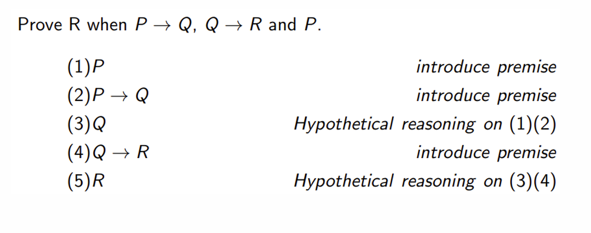

这篇笔记包含lecture7，Deduction ppt 中的内容。上一个ppt（The Application of Propositional Logic）介绍了SAT的具体使用，跳过。  

*对应教材《数理逻辑与集合论》中1.6、2.5、2.7~2.10。*  

## Deduction

现有两个公式 $A$ 和 $B$ ，如果 $A$ 为真时 $B$ 必定为真，则 $A$ 重言蕴含 $B$ （$A \implies B$）。

相关公式：  

- If $A \implies B$, A is a tautology, then B is a tautology.
- If $A \implies B$, $B \implies A$, then $A = B$.
- If $A \implies B$, $B \implies C$, then $A \implies C$.
- If $A \implies B$, $A \implies C$, then $A \implies B \land C$.
- If $A \implies C$, $B \implies C$, then $A \lor B \implies C$.

下面是一个deduction的例子：  

相关规则：  

- 代入规则（Substitution Rule）：对于永真式 $A$ 中的任何命题变量 $P$ ，用另一个公式替换 $A$ 中的所有 $P$ 得到新公式 $B$ ，则 $B$ 也是永真式。
- 置换规则（Replacement Rule）：对于公式 $A$ 中的某个命题变量 $P$ ，将其全部替换为某个公式得到新公式 $B$ ，两公式 $A$ 和 $B$ 具有相同的真值表。
- 条件证明规则：$A \lor B \implies C$ iff $A \implies B \rightarrow C$ 。

### 归结推理法

对于公式 $C_1 = L \lor C_1^\prime$ 和 $C_2 = \neg L \lor C_2^\prime$ ，$R(C_1, C_2) = C_1^\prime \lor C_2^prime$ 是 $C_1$ 和 $C_2$ 的归结式。  

要证明 $A \implies B$ ，也就是证明 $A \land \neg B$ 是永假式。归结推理法就是将原式转为 $A \land \neg B$ 的形式，再转化为CNF，找出归结式并寻找矛盾。  

举例，先要证明 $((P \rightarrow Q) \land (Q \rightarrow R)) \implies (P \rightarrow R)$ ：

将其转化为 $(\neg P \lor Q) \land (\neg Q \lor R) \land P \land \neg R$ 。

前提引入：  

$$\begin{align}
&\neg P \lor Q 
\\& \neg Q \lor R  
\\& P  
\\& \neg P
\end{align}$$

将 $(1)$ 、 $(2)$ 归结，得到

$$\begin{align}
\neg P \lor R
\end{align}$$

将 $(3)$ 、 $(5)$ 归结，得到

$$\begin{align}
R
\end{align}$$

将 $(4)$ 、$(6)$ 归结，矛盾，得证。

## 对偶式

对于公式 $A$ ，将 $A$ 中的 $\lor$ 、 $\land$ 、 $T$ 和 $F$ 对应换为 $\land$ 、 $\lor$ 、 $F$ 和 $T$ ，得到公式 $A^*$ ，则 $A$ 和 $A^*$ 互为对偶式。例如， $(P \land Q) \lor T$ 和 $(P \lor Q) \land F$ 互为对偶式。  

对于对偶式，有如下规则：  

- 若$A = A(P_1, ..., P_n), A^- = A(\neg P_1, ..., \neg P_n)$
    * $\neg (A^*) = (\neg A)^*, \neg (A^-) = (\neg A)^-$
    * $(A^*)^* = A, (A^-)^- = A$
    * $\neg A = (A^*)^-$
- If $A = B$, then $A^* = B^*.$
- 如果 $A \rightarrow B$ 是永真式，则 $B^* \rightarrow A^*$ 是永真式。
- $A$ 和 $A^-$ 的永真性、可满足性相同。
- $\neg A$ 和 $A^*$ 的永真性、可满足性相同。

## Polish Notation

前文中的WFF是中缀表达式。相应的，还有前缀式（波兰式）和后缀式（逆波兰式），与这里的转换普通前中后缀转换相同。  

简单来说，对于一个WFF，将其写成二叉树的形式。则这棵树的前序遍历、中序遍历、后序遍历分别是前中后缀表达式。