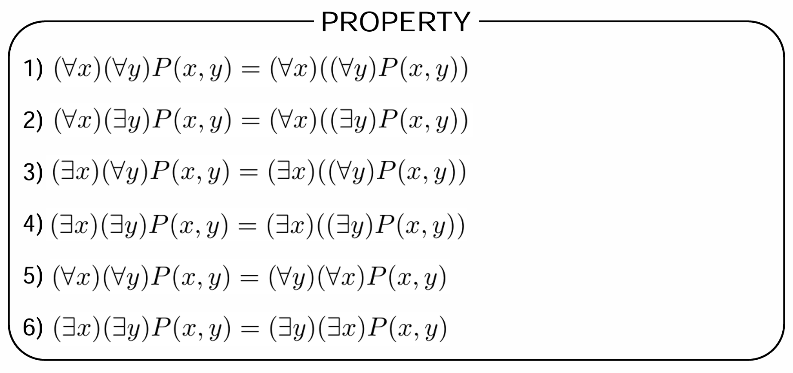

这篇笔记包含lecture8-9，Predicate Logic ppt 中的内容。

*对应教材《数理逻辑与集合论》中4、5章的内容。*

## 基础概念

### 谓词

谓词（predicate）描述了个体词（individual）的属性。个体词的范围称作论域（dismain of decourse）。通常用大写字母代表谓词。每个谓词将个体词映射为真或假，它有一个相关的元数（arity），这是一个表示它接受参数个数的自然数。有 $n$ 个参数的谓词称作 $n$元谓词（$n$-ary predicate）。  

例如，在 $STRONGER(Tom, Jerry)$ 里，$Tom$ 和 $Jerry$ 是谓词， $STRONGER$ 是谓词常项，它接受两个参数。  

另外， $P(x_1, ..., x_n)$ 不一定是命题。只有谓词变项（predicate variable） $P$ 和个体变项（individual variable） $x_1, ..., x_n$ 均为常项（constant）的时候，这才是一个命题。  

### 函数

函数（function）将一个个体词映射到另一个个体词。注意函数不是命题。  

例如， $bestfriend(SpongeBob)$ 不是命题，这个函数的结果是 $PatrickStar$ 。但是 $bestfriend(SpongeBob) == PatrickStar$ 是命题。  

||参数|结果|
|:-:|:-:|:-:|
|联结词|命题|命题|
|谓词|个体词|命题|
|函数|个体词|个体词|

### 量词

量词（quantifier）“将关于个体属性的公式转化为对于某种数量个体属性的公式”，分为全称量词（the universal quantifier）和存在量词（existential quantifier）两种。  

全称量词表示某个论域内所有个体都具有相同的属性，例如 $(\forall x)(LIKEJERRY(x))$ ，其中 $x$ 是约束变元（bound variable）， $(LIKEJERRY(x))$ 是辖域（scope）。  

存在量词表示一个命题可以由论域中某个成员满足，例如 $(\exist x)((\forall y)(x \leq y))$ ，其中 $((\forall y)(x \leq y))$ 是 $(\exist x)$ 的辖域。  

注意，以 $(\exist x)P(x) \land Q(x)$ 为例，其中只有 $P(x)$ 是 $(\exist x)$ 的辖域。第二个 $x$ 被称为自由变元（free variable），不受任何量词约束。  

命题不应该包含自由变量。自由变量可以用常量替换，或者用量词转为约束变量。  

根据变元易名规则，变量的名字可以替换。  

以下是量词的其它规则

  

要更清晰地了解量词，可以在有限论域中考虑。  

那么，有

$$
(\forall x)P(x) = P(1) \land P(2) \land ... \land P(k)
$$

$$
(\exist x)P(x) = P(1) \lor P(2) \lor ... \lor P(k)
$$

### 合式公式  

项（term）是个体词通过函数生成的表达式。原子公式（原子谓词公式，atomic formula）是一种形如 $P(x_1, ..., x_n)$ 的表达式，其中 $P$ 是谓词，而 $x_1, ..., x_n$ 是项。 

合式公式有以下定义：  

1. 每个原子公式都是WFF。

2. 如果 $A$ 和 $B$ 是WFF，则 $\neg A$ ， $A \land B$ ， $A \lor B$ ， $A \rightarrow B$ 和 $A \leftrightarrow B$ 都是WFF，并且要求没有哪个变量在一个公式中是约束变元但在另一个公式中是自由变元。  

3. 如果 $A$ 是WFF，且 $x$ 在 $A$ 中是自由的，那么 $(\forall x)A$ 和 $(\exist x)A$ 是WFF。

4. 除此之外任何公式都不是WFF。

## 判定问题