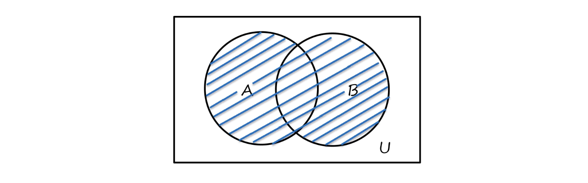
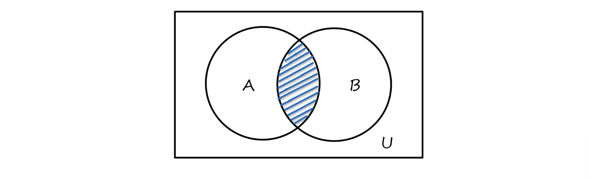

这篇笔记介绍lecture12，集合论的内容。

## 计算问题

如果某个计算问题（Computational Problem）只会严格遵循有限的指令，且在一定次数的操作后一定会终止，则它是可计算的。

## 集合

### 基本概念与性质

集合（set）是不同对象的无序收集，这里的对象可以是任何东西，包括其它集合。如果 $a$ 是集合 $A$ 中的元素，则 $a$ 属于 $A$ ，即 $a \isin A$ ；否则，则 $a$ 不属于 $A$ ，即 $a \notin A$ 。

在元素较少时，可以直接用大括号表示集合，如 $\{1,2,3,4\}$ 。许多常见集合用大写字母表示，如 $C$ 为复数集， $U$ 为考虑范围内所有元素的集合。集合还可以用内涵表示法表示，写为 $\{x|P(x)\}$ 或 $\{x:P(x)\}$ 。这里的 $P(x)$ 是一个谓词逻辑公式，这个集合表示使 $P(x)$ 为真的所有 $x$ 的集合，如 $\{x|x~is~a~prime~number\} = \{2,3,5,7,...\}$ 。  

如果集合 $A$ 与 $B$ 中的元素是完全相同的，则 $A$ 与 $B$ 相等，即 $A = B \Leftrightarrow (\forall x)(x \isin A \leftrightarrow x \isin B)$ 。如果集合 $A$ 中的每个元素都出现在集合 $B$ 中，则 $A$ 包含于 $B$ ，也称 $A$ 是 $B$ 的子集（subset），即 $A \subseteq B \Leftrightarrow (\forall x)(x \isin A \rightarrow x \isin B)$ 。如果 $A$ 是 $B$ 的子集且 $A \not = B$ ，则 $A$ 是 $B$ 的真子集（proper subset），即 $A \subset B \Leftrightarrow (A \subseteq B \land A \not = B)$ 。空集是任何集合的子集。  

集合有三条性质：无序性（unorder）、相异性（distinction）、确定性（deterministic）。无序性指，集合中元素的排列顺序不重要。相异性指，集合中不能出现两个（或多个）同样的元素。确定性指，对于元素 $a$ ，只存在 $a \isin A$ 或 $a \notin A$ 两种情况，并且 $a$ 是否属于 $A$ 是确定的且互斥的。

### 运算

- 并（union）  
$A \cup B = \{x|x \isin A \lor x \isin B\}$  

- 交（intersection）  
$A \cap B = \{x|x \isin A \land x \isin B\}$  

  

- 差（difference）  
$A - B = \{x|x \isin A \land x \notin B\}$  

- 补（complement）  
$-A~or~\overline A = \{x|x \isin U \land x \notin A\}$  

- 对称差（symmetric difference）  
$A \oplus B = \{x|x \isin A \overline \lor x \isin B\} = (A - B) \cup (B - A)$  
（这里的 $\overline \lor$ 表示异或）  

  

- 广义并（generalized union）  
$\cup A = \{x|(\exist z)(z \isin A \land x \isin z)\}$  
$\cup \varnothing = \varnothing$

- 广义交（generalized intersection）  
$\cap A = \{x|(\forall z)(z \isin A \rightarrow x \isin z)\}$  
$\cap \varnothing$ 未定义。

注意广义并和广义交运算要求集合的元素也是集合。

### 公式

同一律（identity law）  

- $A \cap U = A$
- $A \cup \varnothing = A$

交换律（commutative law）  

- $A \cup B = B \cup A$
- $A \cap B = B \cap A$

零律（domination law）

- $A \cup U = U$
- $A \cap \varnothing = \varnothing$

结合律（associative law）

- $A \cup (B \cup C) = (A \cup B) \cup C$
- $A \cap (B \cap C) = (A \cap B) \cap C$

等幂律（idempotent law）

- $A \cup A = A$
- $A \cap A = A$

分配律（distributive law）

- $A \cup (B \cap C) = (A \cup B) \cap (A \cup C)$
- $A \cap (B \cup C) = (A \cap B) \cup (A \cap C)$

双补律（complementation law）  

- $\overline {(\overline A)} = A$

补余律（complement law）

- $A \cup \overline A = U$
- $A \cap \overline A = \varnothing$

吸收率（absorption law）

- $A \cup (A \cap B) = A$
- $A \cap (A \cup B) = A$ 

摩根律（De Morgan's law）

- $\overline {A \cap B} = \overline A \cup \overline B$
- $\overline {A \cup B} = \overline A \cap \overline B$
- $A - (B \cap C) = (A - B) \cup (A - C)$
- $A - (B \cup C) = (A - B) \cap (A - C)$

### 相关问题证明

集合论的相关基础证明有三种解题方案：使用定义、转换为逻辑等式、使用相关定律。可以用韦恩图辅助理解，但不能将其用于证明。  

下面是三个使用了不同证明方法的例子。  

1. $proof~A \cup B = B \Rightarrow A \subseteq B$  

$$
\begin{aligned}
&For~any~x,~assume~x \isin A
\\&\therefore x \isin A \cup B  
\\&\because A \cup B = B~\therefore x \isin B  
\\&\therefore A \subseteq B
\end{aligned}
$$

2. $proof~A - (B \cup C) = (A - B) \cap (A - C)$

$$
\begin{aligned}
x \isin A - (B \cup C) &\Leftrightarrow (x \isin A) \land (x \notin (B \cup C))
\\&\Leftrightarrow x \isin A \land x \notin B \land x \notin C
\\&\Leftrightarrow (x \isin A \land x \notin B) \land (x \isin A \land x \notin C)
\\&\Leftrightarrow (x \isin (A - B)) \land (x \isin (A - C))
\\&\Leftrightarrow x \isin ((A - B) \cap (A - C))
\end{aligned}
$$  

3. $proof~\overline{A \cup (B \cap C)} = (\overline C \cup \overline B) \cap \overline A$  

$$
\begin{aligned}
\overline{A \cup (B \cap C)} &= \overline A \cap \overline {B \cap C}
\\&=\overline A \cap (\overline B \cup \overline C)
\\&=(\overline B \cup \overline C) \cap \overline A
\\&=(\overline C \cup \overline B) \cap \overline A
\end{aligned}
$$

## 语言识别问题

在计算问题中，判定问题可以通过decider解决，但其它问题不行。要解决其它问题，可以找出可能的答案，用decider验证答案是否正确。  

某些这个过程（在某种意义上）可以转化为membership problem。定义量词 $P$ ，使得使 $P(x)$ 为真的 $x$ 是有效输入且符合问题的要求。令 $S = \{x|P(x)\}$ ，判断 $x$ 是否为有效答案时，只需要判断 $x$ 是否在 $S$ 中。  

用语言识别问题（a membership problem of language）来描述，原问题可以改为“$Give~a~language~L~and~take~w~as~input,~determine~whether~w\isin L$”。