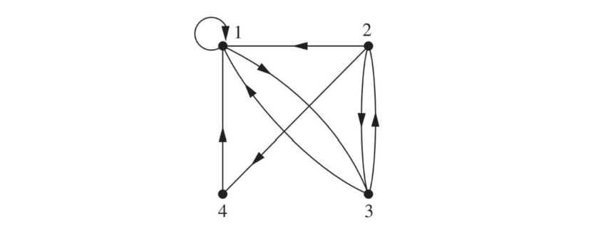

这篇笔记介绍lecture14，Binary Relation I。

## 前置知识

### 有序对

有序对 $<a,b>$ 是包含 $a$ 、 $b$ 两元素，其中 $a$ 是第一个元素， $b$ 是第二个元素。

有序对满足  

- $a \not = b \Rightarrow <a, b> \not = <b, a>$  
- $<a, b> \not = <c, d> \Leftrightarrow a = c \land b = d$

可以通过集合来描述有序对，定义 $<a,b> = \{\{a\}, \{a, b\}\}$ 。如果 $a = b$ ，则 $<a, b> = \{a\}$ 。如果 $a \not = b$ ，则 $<a, b> = \{\{a\}, \{a, b\}\}$ ， $<b, a> = \{\{b\}, \{a, b\}\}$ ，显然这两个集合不相等，符合上面的第一条规律。此外， $\{\{a\}, \{a, b\}\} = \{\{c\}, \{c, d\}\} \Leftrightarrow a = c \land b = d$ ，满足上面的第二条规律。 

### 笛卡尔积

对于集合 $A$ 和 $B$ ，它们的笛卡尔积写作 $A \times B$ 。它们代表有序对 $<a,b>$ 的集合，其中 $a \in A$ ， $b \in B$ 。也就是说， $A \times B = \{<a, b>|a \in A \land b \in B\}$ 。

空集和任何集合的笛卡尔积都是空集。

笛卡尔积可以用平面直角坐标系来表示。  

## 关系

两个对象之间的关系称为二元关系（binary relation）。这门课只研究二元关系。  

### 基本概念

如果 $A$ 和 $B$ 是集合，从 $A$ 到 $B$ 的二元关系就是 $A \times B$ 的子集。也就是说， $A$ 到 $B$ 的关系 $R$ 是有序对的集合。 $aRb$ 代表 $<a,b>$ 属于 $R$ ， $a\cancel{R} b$ 代表 $<a,b>$ 不属于 $R$ 。  

对于从 $A$ 到 $B$ 的关系 $R$ ，定义 $R$ 的定义域（domain） $dom(R) = \{x|(\exist y)(<x, y>\in R)\}$ ，值域（range） $ran(R) = \{y|(\exist x)(<x, y>\in R)\}$ ，域（field） $fld(R) = dom(R) \cup ran(R)$ 。  

例如，定义集合 $A = \{1,2,3\}$ ， $R = \{<x,y>|x\in A \land y \in A \land x|y\}$ （其中 $x|y$ 代表 $y$ 能被 $x$ 整除）。则 $R = \{<1, 1>, <1, 2>, <1, 3>, <2, 2>, <3, 3>\}$ ， $dom(R) = \{1, 2, 3\}$ ， $ran(R) = \{1, 2, 3\}$ ， $fld(R) = \{1, 2, 3\}$ 。  

对于任何集合 $A$ ，有一些特殊关系。  

- 恒等关系（identity relation）：$I_A = \{<x, x>|x \in A\}$ 
 
- 全域关系（universal relation）：$E_A = \{<x,y>|x \in A \land y \in A\}$

- 空关系（empty relation）：$N_A = \varnothing$  

对于 $A$ 中的任意元素 $x$ 、 $y$ ，永远有 $x\cancel{N_A}y$ 、 $xE_Ay$ ，当且仅当 $x=y$ 时有 $xI_Ay$ 。 

### 关系矩阵与关系图

$R$ 是从 $A$ 到 $B$ 的关系，则 $R$ 可以用零一矩阵 $M_R = (m_{ij})_{m \times n}$ 表示，有  

$$
m_{ij} = 
\begin{cases}
\text{$1~~if<a_i,b_j>\in R$} \\
\text{$0~~if<a_i,b_j>\not \in R$}
\end{cases}
$$

如果 $R$ 是 $A$ 上的关系， $M_R$ 是方阵。  

例如，如果 $A = \{1, 2, 3, 4\}$ ， $R = \{<1, 1>, <1, 3>, <2, 1>, <2, 3>, <2, 4>, <3, 1>, <3, 2>, <4, 1>\}$ ，则  

$$
M_{R} = 
\begin{bmatrix}
1 & 0 & 1 & 0 \\
1 & 0 & 1 & 1 \\
1 & 1 & 0 & 0 \\
1 & 0 & 0 & 0 
\end{bmatrix}
$$

类似地，有  

$$
M_{I} = 
\begin{bmatrix}
1 & 0 & 0 & 0 \\
0 & 1 & 0 & 0 \\
0 & 0 & 1 & 0 \\
0 & 0 & 0 & 1
\end{bmatrix}
$$

$$
M_{E} = 
\begin{bmatrix}
1 & 1 & 1 & 1 \\
1 & 1 & 1 & 1 \\
1 & 1 & 1 & 1 \\
1 & 1 & 1 & 1
\end{bmatrix}
$$

$$
M_N = 
\begin{bmatrix}
0 & 0 & 0 & 0 \\
0 & 0 & 0 & 0 \\
0 & 0 & 0 & 0 \\
0 & 0 & 0 & 0
\end{bmatrix}
$$

关系还可以通过关系图来表示。在关系图中，顶点代表元素， $aRb$ 代表图中出现一条由 $a$ 向 $b$ 的有向边。例如，对于 $A = \{1, 2, 3, 4\}$ ， $R = \{<1, 1>, <1, 3>, <2, 1>, <2, 3>, <2, 4>, <3, 1>, <3, 2>, <4, 1>\}$ ，关系图如图  

  

### 关系的运算

集合的基本运算在关系中也成立。此外，关系还有一些其它的运算。  

$R$ 为从 $A$ 到 $B$ 的关系，则 $R$ 的逆（inverse），写作 $R^{-1}$ ，是集合 $\{<a,b>|<b,a> \in R\}$ ，且 $M_{R^{-1}} = M_R^T$ 。  

$R$ 为从 $A$ 到 $B$ 的关系， $S$ 为从 $B$ 到 $C$ 的关系，则 $R$ 和 $S$ 的合成（composite）写作 $S \circ R$ ，是集合 $\{<x, y>|(\exist z)(<x,z>\in R \land <z,y>\in S)\}$ 。令 $M_R = (r_{ij})$ ， $M_S = (s_{ij})$ ， $M_{S \circ R} = M_R \odot M_S = (w_{ij})$ ，其中 $\odot$ 代表矩阵的布尔积， $w_{ij} = \lor _{k=1}^n(r_{ik} \land s_{kj})$  。例如  

$$
\begin{bmatrix}
1 & 0 & 1 \\
0 & 1 & 1
\end{bmatrix}

\odot

\begin{bmatrix}
1 & 1 \\
0 & 0 \\
0 & 1 \\
\end{bmatrix}

= 

\begin{bmatrix}
1 & 1 \\
0 & 1
\end{bmatrix}
$$

其中有  
- $w_{11} = (1 \land 1) \lor (0 \land 0) \lor (1 \land 0) = 1$  
- $w_{12} = (1 \land 1) \lor (0 \land 0) \lor (1 \land 1) = 1$  
- $w_{21} = (0 \land 1) \lor (1 \land 0) \lor (1 \land 0) = 0$  
- $w_{22} = (0 \land 1) \lor (1 \land 0) \lor (1 \land 0) = 1$  

关系的逆和合成有下面这些性质。  

- $dom(R^{-1}) = ran(R)$
- $ran(R^{-1}) = dom(R)$  
- $(R^{-1})^{-1} = R$
- $(S \circ R)^{-1} = R^{-1} \circ S^{-1}$
- $(R \circ S) \circ Q = R \circ (S \circ Q)$
- $R_1 \circ (R_2 \cup R_3) = R_1 \circ R_2 \cup R_1 \circ R_3$
- $(R_1 \cup R_2) \circ R_3 = (R_1 \cup R_3) \circ (R_2 \cup R_3)$
- $R_1 \circ (R_2 \cap R_3) \subseteq (R_1 \circ R_2) \cap (R_1 \circ R_3)$
- $(R_1 \cap R_2) \circ R_3 \subseteq (R_1 \circ R_3) \cap (R_2 \circ R_3)$

对于集合 $A$ 上的关系 $R$ ， $n \in N$ ，则 $R$ 的 $n$ 次幂（power）写作 $R^n$ 。  

$$
R^n = 
\begin{cases}
\text{$I_A,~~n = 0$} \\
\text{$R^n \circ R,~~n \not = 0$}
\end{cases}
$$

对于关系的幂，有  
- $R^m \circ R^n = R^{m + n}$  
- $(R^m)^n = R^{mn}$
- $A$ 是有限集合， $R$ 是 $A$ 上的关系，存在自然数 $s$ ， $t$ ，且 $s \not = t$ 使得 $R^s = R^t$ 。

## 关系的划分

### 关系的性质

如果 $(\forall a)(a \in A \rightarrow aRa)$ ，则 $R$ 是自反的（reflexive）。如果 $(\forall a)(\forall b)((a \in A \land b \in A \land aRb) \rightarrow bRa)$ ，则 $R$ 是对称的（symmetric）。如果 $(\forall a)(\forall b)(\forall c)((a \in A \land b \in A \land c \in A \land aRb \land bRc) \rightarrow aRc)$ ，则 $R$ 是传递的（transitive）。

对称关系等价于 $R^{-1} = R$ ，即 $M_R = M_R^T$ 。  

如果 $R_1，R_2$ 是自反的，则 $R_1^{-1}，R_1 \cup R_2，R_1 \cap R_2$ 是自反的。如果 $R_1，R_2$ 是对称的，则 $R_1^{-1}，R_1 \cup R_2，R_1 \cap R_2$ 是对称的。如果 $R_1，R_2$ 是传递的，则 $R_1^{-1}，R_1 \cap R_2$ 是传递的。

### 划分

集合的划分（partition）是指将集合划分为不相交的、非空的子集。更正式地说，对于一个非空集合 $A$ 和集合 $\pi$，如果有  

- $\varnothing \notin \pi$
- $(\forall x)(x \in \pi \rightarrow x \subseteq A)$
- $\cup \pi = A$
- $(\forall x)(\forall y)((x \in \pi \land y \in \pi \land x \not = y) \rightarrow x \cap y = \varnothing)$

则 $\pi$ 是 $A$ 的一个划分。

对于 $A$ 的划分 $\pi$ ，可以定义关系 $R$ ，如果 $a，b$ 在同一个划分块里，则有 $aRb$ ，即 $R = \{<a,b>|(\exist \pi_0)(\pi_0 \in \pi \land a \in \pi_0 \land b \in \pi_0)\}$ 。

### 等价关系

如果某个关系是自反的、对称的、传递的，则这个关系是等价关系（equivalence relation）。若 $R$ 是 $A$ 上的等价关系，对于任何 $x \in A$ ， $x$ 上的等价类（equivalence class）是 $[x]_R = \{y|y \in A \land xRy\}$ 。  

### 商集

对于集合 $A$ 上的等价关系 $R$ ， $A$ 的商集指 $A$ 的所有不相交的等价类，写作 $A/R$ ，有 $A/R = \{y|(\exist x)(x \in A \land y = [x]_R)\}$ 。 $A/R$ 是 $A$ 的一个划分。

### 等价关系与划分

对于 $A$ 的划分 $\pi$ ，可以定义等价关系 $R = \{<a,b>|(\exist \pi_0)(\pi_0 \in \pi \land a \in \pi_0 \land b \in \pi_0)\}$ 。即划分可以产生等价关系。  

反过来，对于 $A$ 上的等价关系 $R$ ， $A/R$ 是 $A$ 的划分，即通过等价关系可以产生划分。