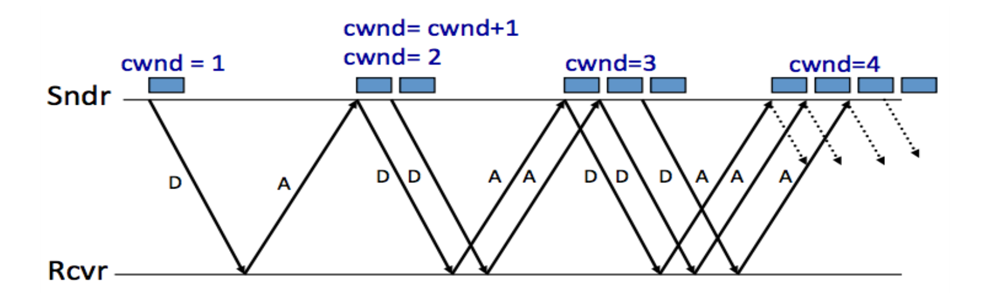

## Network

网络架构自上而下：

- application
- transport layer
- network layer
- link layer

### LINK

hamming distance：两个数之间，比特位翻转的数量。  

在n bit的编码中，可以只规定部分合法的编码。如果某一位出错，大概率得到非法编码，可以确认数据是否有误。编码中，将四位数据扩展到七位，具体算法如下：

$$
P_1 = P_7 \oplus P_5 \oplus P_3 \\
P_2 = P_7 \oplus P_6 \oplus P_3 \\
P_4 = P_7 \oplus P_6 \oplus P_5
$$

如果错的位数太多，可能会错误纠错；所以仍然需要校验位。

link layer使用PPP协议。PPP协议通过LCP管理，通过握手方式判断接收方是否有能力接收数据。

### IP

#### Routing

Distance-vector用bellman-ford算法更新。新节点向邻居节点发送自己的信息，邻居节点向新节点发送自己的最短路，新节点更新，然后重新发送。节点断联时，可能会导致无穷计数问题。

这两种路由都不适合过于复杂的情况。有三种scale机制：

- 
- path vector
- topological addressing

path vector与distance vector类似，但维护两张表；一张是相同的forwarding table，但同时还会存到各个节点的具体路径。这种设计可以避免环导致的无穷问题，也可以做一些更精细的控制。

#### NAT

路由器会将发送给自己的IP做翻译，并维护一张IP+port的关系表。收到消息时，通过port判断应该回复到哪台机器的哪个端口。

#### ARP

ARP协议中，机器A要向机器B发送消息，需要机器B的mac地址。如果不知道地址，它会提问；回复会被广播。所有听到答案的机器都会记录/更新机器B的地址。

### End to End

这一层负责维护延迟、顺序等信息。

任何尝试都只能有有限次数，且需要决定timeout。

#### at least once

timeout不能是固定的，根据rtt（to + process + back）决定。可以设置为rtt的150%，或每次乘以二。

adapative：如果sender发现timeout，重发。  
nak：reciver发现包不全时，如果timeout，通知adapative重发。

#### at most once

at most once需要维护哪些包是已收到的（tombstone）。实践中，tombstone会在五个rtt后删除。

#### data integrity

在end2end再加一层校验。

#### segments and reassembly

reciver时，只接受顺序发送的包。不遵守顺序的包会放在buffer里。如果buffer满，就将剩下的包丢弃。此外，还可以用NAK提速。

#### jitter control

平均延迟为$D_{headway}$，缓冲数量为$(D_{long} - D_{short}) / D_{headway}$。

#### security

对称加密&非对称加密（具体见11）。

#### performance

需要在保持可靠性的情况下发挥出最大的性能，TCP采用pipeline方案。实际采用滑动窗口，sender每收到一个ack就发送下一个包。

windowsize应该大于等于rtt * bottleneck data rate，才能充分利用带宽。这里的bottle指sender和receiver中较小的带宽。此外，考虑到congestion，还需要windowsize小于等于 min(rtt * bottle data rate, receiver buffer)。

实际上window会变化：线性增加，指数减少。如果没有丢包，window+1；否则window除以二。此外，除以二的方式还会促进fairness。

这种方法在开始时会浪费。解决方案是第一次指数上涨；duplicate后线性上涨；timeout后delay，然后从零重新开始。

#### weakness of TCP

- 路由器buffer可能导致delay
- 丢包可能不是由congestion导致的
- 不适合datacenter
- 对long rtt有偏见

### DNS&CDN

DNS可以理解为human-friendly name。

实际域名有一定层级，访问域名时按照层级逐渐找到IP地址。访问后相关层级信息会被缓存。

DNS分为non-recursion和recursion两种。后者更快，但是是有状态的。 

CDN指content distribution network，可以理解为缓存。此外，如果请求发送给了较远的服务器，服务器可以返回另一个服务器地址而不是文件本身。