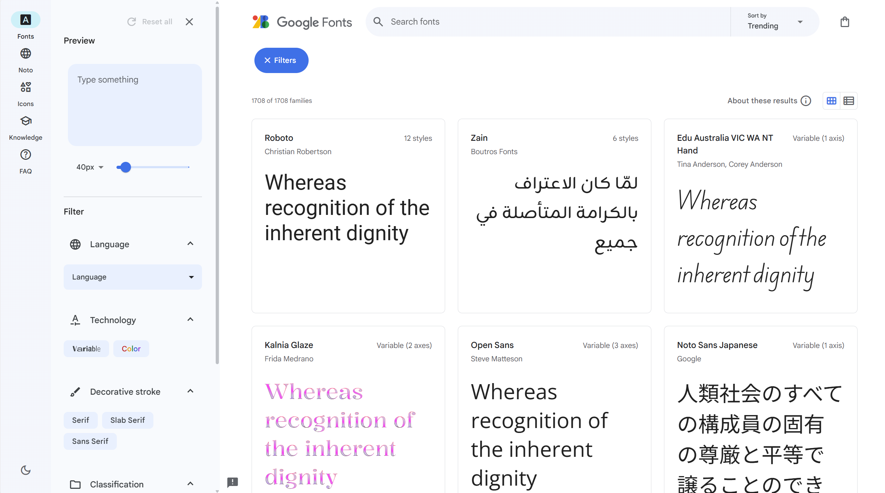
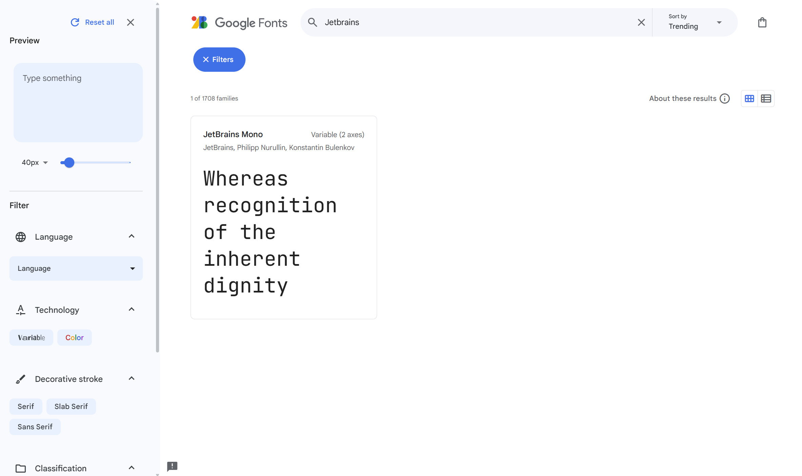
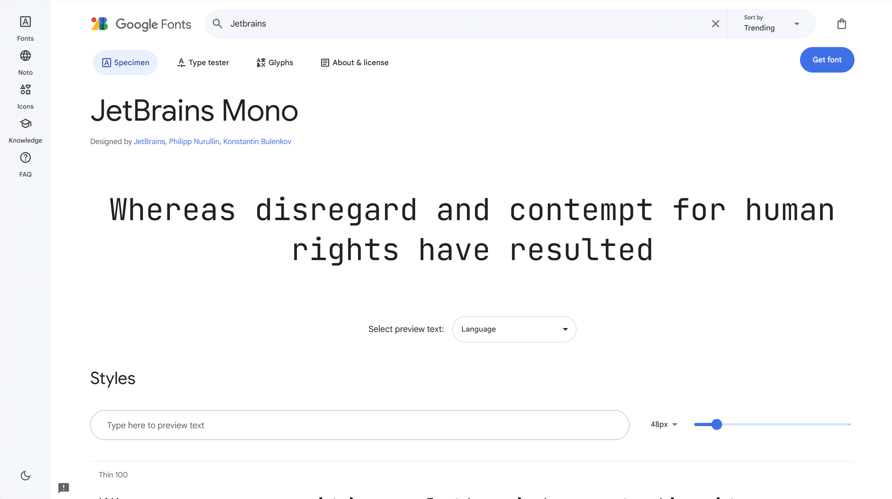
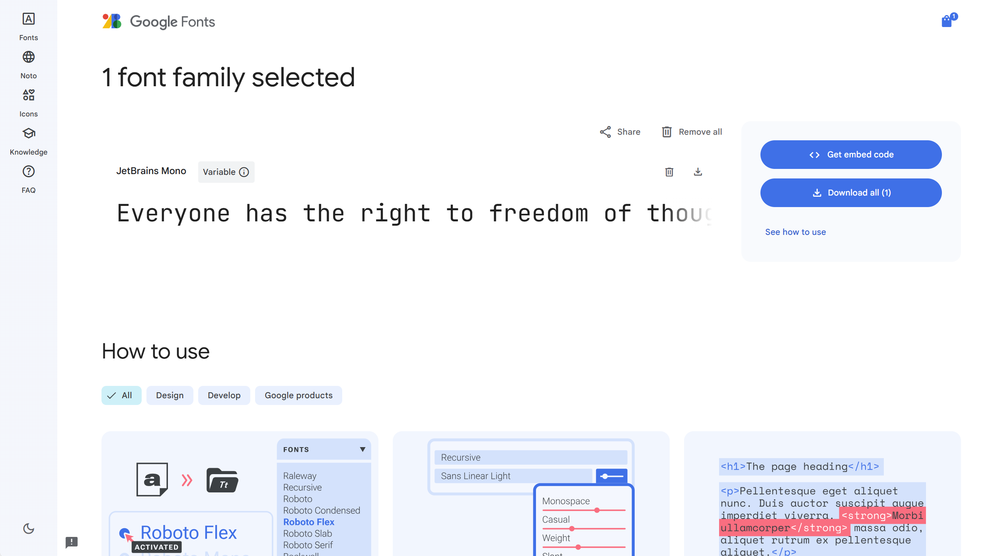
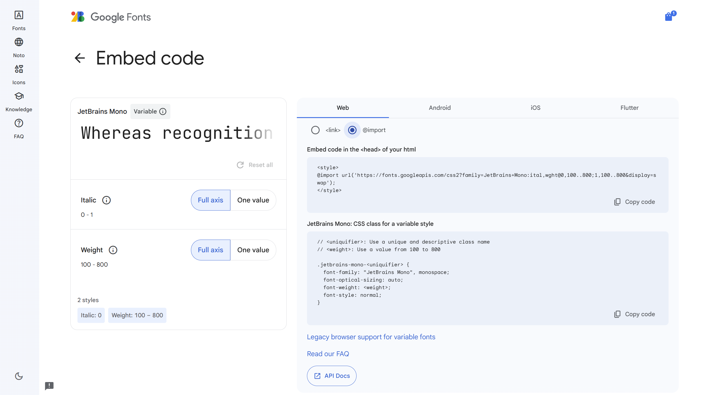

## W0: Catbook

### 相关网址

ppt网址：  
[https://docs.google.com/presentation/d/1xKW5HjDCtBAyutBviqjx1bbKR43d0shT39F3eSnOUA4/edit#slide=id.p78](https://docs.google.com/presentation/d/1xKW5HjDCtBAyutBviqjx1bbKR43d0shT39F3eSnOUA4/edit#slide=id.p78)  

源代码git库网址：  
[https://github.com/weblab-workshops/catbook-react](https://github.com/weblab-workshops/catbook-react)  

我的完成代码网址：  
[https://github.com/key4127/MIT-Web-Development-Crash-Course/tree/main/w0%20catbook-react](https://github.com/key4127/MIT-Web-Development-Crash-Course/tree/main/w0%20catbook-react)  

flex学习相关：  
[https://css-tricks.com/snippets/css/a-guide-to-flexbox/](https://css-tricks.com/snippets/css/a-guide-to-flexbox/)  
[https://flexboxfroggy.com/](https://flexboxfroggy.com/)  
[http://www.flexboxdefense.com/](http://www.flexboxdefense.com/)  

ppt中用到的google fonts：  
[https://fonts.google.com/](https://fonts.google.com/)  

### 使用说明

基本上参照ppt即可，省略部分内容。  

将库克隆到本地并进入库文件夹。  

```shell
git clone git@github.com:weblab-workshops/catbook-react.git
cd catbook-react
```

整个w0（包括选做部分）共包含十四步。进行每一步前，执行  

```shell
git reset --hard
git checkout w0-stepx
```

将``x``替换为对应数字。  

注意这里每次 ``git reset`` 都会回到原来的版本。

我的完成代码是在 ``w0-complete`` 基础上修改的。  

### step 0-2

插入标题、内容、图片。  

### step 3

将内容加入类并设置居中。  

```css
u.textCenter {
    text-align: center;
}
```

### step 4

googlefont网站似乎改版了，使用方式和ppt中提到的不一样。  

这里我使用的是 ``Jetbrains Mono`` 字体（不过 ``reset`` 后还是会回到ppt的字体）  

进入网站  



搜索 ``Jetbrains``  

  

选中，点击右上角 ``Get font``  



点击右侧 ``Get embed code``  



在右侧 ``web`` 下选择 ``@import``，上面是 ``import`` 格式，下面是使用格式。  

  

### step 5

添加导航工具条（navBar）。  

在css中，可以这样定义变量：  

```css
:root {
    --primary: #396dff;
    --grey: #f7f7f7;
    --white: #fff;
}
```

变量名必须由 ``--`` 开始。  
使用 ``var(primary)`` 可以获取变量值。  

### step 6

通过设置背景色调整navBar样式。  

### step 7

在css中，所有元素都被一系列 ``box`` 包裹着。  

  

在类中设置 ``margin`` 为0。  
关于 ``margin`` 的多个参数见ppt。  

### step 8-9

使用 ``border-radius`` 设置圆角，进一步设置圆形。  

设置圆形需要宽高相等。  

```css
.avatar {
  width: 100%;
  height: auto;
  padding-top: 100%;
  border-radius: 50%;
}
```

### step 10-11

用flex设置格式（参照ppt）。  

```css
.subContainer {
    flex-grow: 1;
    flex-basis: 0;
}
```

### step 12 完成

如果完全按照ppt样式进行，成品如下：  


### step 13

一些练习，答案见 ``w0-complete`` 。  

注意在设置线条颜色时，线条默认有黑色 ``border`` ，调整线条颜色可以去掉 ``border`` 再设置颜色或者背景颜色，也可以直接调整 ``border-color`` 。

