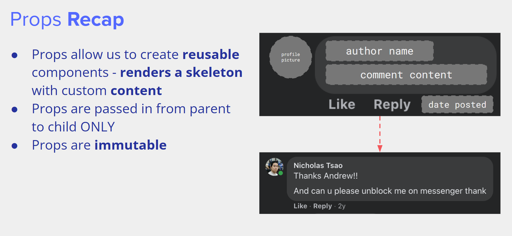

## React

### 介绍

react是一个开源JavaScript库，其中包含很多组件（component），每个组件是一个“fake HTML tag”。组件可以在一个文件里（抽象地）实现一系列html、css、js的功能。其中各种组件以一定结构（类似树）组织在一起。  

  

### props

props 代表从亲组件到子组件中传递的信息。react可以通过亲组件决定子组件的各种属性，它是不可变的，并且不能子到亲反向传递。  

  

### state

state代表组件所维护的信息，它是可变的，可以根据程序设置或用户输入修改。  

以post state为例，对于post（亲组件），它没有props，只有state，state存储了各条评论（子组件）。而子组件没有state只有props：评论发出后就不可修改，但评论数、评论如何修改可变。  

  

更进一步地，现在要给评论添加回复功能，注意回复有默认全部隐藏/全部显示两种状态，并且评论的内容一旦发布就不可变。那么，合理的解决方案是给评论增加state，将回复作为评论的子组件，通过state调整回复隐藏/显示。  

  

### 组件结构（component structure）

props和state共同构成了component structure。下图是前两部分的总结：  

  

## react practice

### 说明与相关网址

### 评论

练习中的评论由两部分构成：评论人和评论内容。  

首先，ppt带着我们创建了一个框架：  

```JavaScript
import React, { useState } from 'react'

const CommentReply = (props) => {

    // Function logic (JavaScript)

    return (
        // to render
    )
}

export default CommentReply
```

``import React, { useState } from 'react'`` 从react库中导入了React对象和useState hook（暂略）。``CommentReply`` 定义了一个函数组件， ``props`` 作为函数参数代表组件属性， ``return`` 中的部分是需要渲染的内容。最后一行 ``export default CommentReply`` 将这个组件设置为默认导出，导出允许将函数、类等共享到另一个文件。  

接下来，添加需要render的内容：  

```JavaScript
const CommentReply = (props) => {
    return (
        <div className="comment-text">
            <h5>Joyce Yoon</h5>
            <p>woww peak preschool energyy</p>
        </div>
    )
}
```

括号中的 ``<div>`` 是需要渲染的内容。但是这段代码无法复用，解决方案是将评论中的信息通过props传递（大括号允许读取组件中变量的值）。  

```JavaScript
const CommentReply = (props) => {
    return (
        <div className="comment-text">
            <h5>{props.name}</h5>
            <p>{props.content}</p>
        </div>
    )
}
```

另外，注意到在这段js代码里，出现了类似HTML的内容。这部分内容被称作JSX。kimi的说法是JSX是js的语法扩展，允许写入类似HTML的标记；而ppt将JSX称作“stricter version of HTML”。  

从这个网站可以直观地看到HTML和JSX的差异：  
[https://transform.tools/html-to-jsx](https://transform.tools/html-to-jsx)  

下一步是增加state。在 ``return`` 之前添加一行：  

```JavaScript
const [isLiked, setIsLiked] = useState(false)
```

这句话通过 ``(false)`` 将 ``isLiked`` 这个state初始化为false，并声明 ``setIsLiked`` 是用于更新 ``isLiked`` 状态的函数。  
使用 ``setIsLiked(true)`` 等类似语句可以更改 ``isLiked`` 状态。

接下来，在 ``return`` 的部分添加  

```JavaScript
<p>{isLiked ? "Liked" : "Like"}</p>
```

按照相应条件渲染 ``isLiked`` （具体见w2）。

### facebook

facebook的结构如下：  

  

相关代码写在 app.js 中，可以看到facebook包含app、navbar、intro、photos、post五个部分。  

```JavaScript
import React from "react";
import NavBar from "./NavBar";
import Intro from "./Intro";
import Photos from "./Photos";
import Post from "./Post";

const App = () => {
    return (
        <div>
            <NavBar />
            <div>
                <Intro />
                <Photos />
            </div>
            <Post />
        </div>
    );
};

export default App;
```

在最开始的导入部分，首先导入了react库，然后从NavBar.js、Intro.js等文件导入各个组件。然后 ``return`` 返回一个div组件，将NavBar等包含为它的子组件，最后设置App导出。  

可以看到上文中react库的两次导入使用了不同的语法：  

```JavaScript
import React from "react";
import React, { useState } from 'react'
```

在上面两行导入中，第一行只导入了react库，第二行额外导入了一个钩子。在JavaScript中，分号是可选的，第一行显示地使用了分号，第二行省略了。此外，通常来说，JavaScript中单引号和双引号没有区别。  

下一步是由亲组件向子组件传递props。传递props的语法是，在亲组件 ``return`` 的div里写  

```JavaScript
<Post name="Kenneth" text="Welcome to web lab!" />
```

其中 ``Post`` 是子组件，而 ``name`` 和 ``text`` 以及它们的内容就是props。  

```JavaScript
const App = () => {
    return (
        <div>
            <NavBar />
            <div>
                <Intro education="Massachusetts Institute of Technology (MIT)" city="Ridgefield, Connecticut" />
                <Photos links={["pic1.jpg", "pic2.jpg", "pic3.jpg", "pic4.jpg", "pic5.jpg", "pic6.jpg", "pic7.jpg"]} />
            </div>
            <Post name="Kenneth Choi" text="Sign up for web lab!" />
        </div>
    );
};
```

现在App.js中的内容已经完成，下一步是利用props完成各个子组件的渲染。在亲组件中传递的props会出现在子组件的参数中。  

**Intro.js**

```JavaScript
import React from "react";

const Intro = (props) => {
    return (
        <div>
            <p>
                Studies at <b>{props.education}</b>
            </p>
            <p>
                From <b>{props.city}</b>
            </p>
        </div>
    )
};

export default Intro;
```

其中 ``<b>`` 标签表示文本加粗。  

**Photos.js**

```JavaScript
import React from "react";

const Photos = (props) => {
    const myImageTags = props.links.map((photoLink) => {
        return ;
    });

    return (
        <div>
            <h3>Photos</h3>
            {myImageTags}
        </div>
    )
}

export default Photos;
```

这段代码利用map创建了一个数组，对于每个 ``photoLink`` 返回一个img标签。JSX用花括号引入JavaScript表达式，将其渲染到了页面上。  

**Post.js**

```JavaScript
import React, { useState } from "react";

const Post = (props) => {
    const [isLiked, setIsLiked] = useState(false);
    
    return (
        <div className="Post">
            <h3>{props.name}</h3>
            <p>{props.text}</p>
            <button
                onClick = {() => {
                    setIsLiked(!isLiked);
                }}>
                {isLiked ? "Liked" : "Like"}
            </button>
        </div>
    );
};

export default Post;
```

其中 ``<button>`` 的部分会在以后的课程中提及。  

显然课堂上的这些练习没有完成一个完整的项目，对这个项目的完善将写在补充部分中。  

### 总结

这两张幻灯片可以概括这节课的内容：  

  

  


### 补充