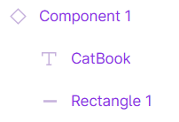

## UI/UX

### 介绍

这部分介绍了UI、UX、线框图以及prototyping。UI代表用户界面（色彩搭配、字体、布局等），UX代表用户体验，线框图指网站的蓝图/框架，prototyping（原型设计）代表实验性的、可以演示功能的版本。具体的介绍省略（见PPT）。  

以下是两个相关网址：  

展现UI随时间的变化：  
[https://uxdesign.cc/how-visual-design-trends-have-evolved-over-the-years-730a8ed43970](https://uxdesign.cc/how-visual-design-trends-have-evolved-over-the-years-730a8ed43970)  

新手的UI设计教程：  
[https://blog.prototypr.io/ui-design-guide-for-non-designers-beginners-ea394f3d9e41](https://blog.prototypr.io/ui-design-guide-for-non-designers-beginners-ea394f3d9e41)  

## figma

figma是一款基于浏览器设计的UI设计工具。  

### 相关网址  

figma官网（注册）：  
[https://www.figma.com/](https://www.figma.com/)

figma网页：  
[https://www.figma.com/file/238AmdjDNOKW9tDEMBd4WX/6.170-PS3?t=SQZyHwDJ03YgRj1q-0](https://www.figma.com/file/238AmdjDNOKW9tDEMBd4WX/6.170-PS3?t=SQZyHwDJ03YgRj1q-0)  

figma移动端：  
[https://www.figma.com/file/CE1FIoHtLsRdReBomQ2SAR/Dashboard-App-UI-KIT-21-screens-total-(Community)?node-id=0%3A1&t=E7kN3ZQhKCXBUT93-0](https://www.figma.com/file/CE1FIoHtLsRdReBomQ2SAR/Dashboard-App-UI-KIT-21-screens-total-(Community)?node-id=0%3A1&t=E7kN3ZQhKCXBUT93-0)  

这门课的figma教程：  
[https://drive.google.com/file/d/1BJesvDGOprIPs-FtDjfRHVbBtPGYsVFW/view](https://drive.google.com/file/d/1BJesvDGOprIPs-FtDjfRHVbBtPGYsVFW/view)  

### figma基础

**step 1：注册**

首先在 [https://www.figma.com/](https://www.figma.com/) 创建账号并创建新的design file。  

可以看到figma界面由许多板块组成。  

  

**step 2：创建框架**

按照ppt的教程创建一个框架。  

（点击Frame图标（类似井号），在右侧选择框架）

**step 3：创建navbar**

创建一个长方形、调整颜色、创建文本框，创建navbar。  

**step 4：把navbar变成一个元件**

右键选择“create component”。在创建元件后，原来的部分可以复用。  

**step 5：在新框架中复用navbar并添加图片**

首先如图新建页面（注意不是新建文件）

  

然后复用原来的navbar。  
添加图片，设置宽高、位置和圆角。  

**step 6：更改原来的navbar**

  
  
  

可以看到上图两个元件的符号不同。前一个是“元件”，对它的改变会影响到所有复用它的部分；后一个是实例，无法添加新的对象。  

**step 7：建立component library**

新建页面（page），建立component library。将原来的component复制、删除，然后粘贴到component library中，则main component被移动到了这里。  

  

然后在原来component内添加新的要素。选中component内的元素再新建，新建的部分就会被归类到component里。  

  

更改后发现原来页面的navbar变成了更改后的样子。

**step 8：给两个页面增加交互操作**

按照ppt教程，选择对象，设置prototype -> add interaction，在click选项下，将none改为目标页面。  

   

**step 9：预览**

按照上面的步骤，demo已经完成。在未选择任何对象的前提下，在右侧prototype下可以选择设备来运行demo。  

除此之外，figma还提供共享、以css格式复制等功能。  
