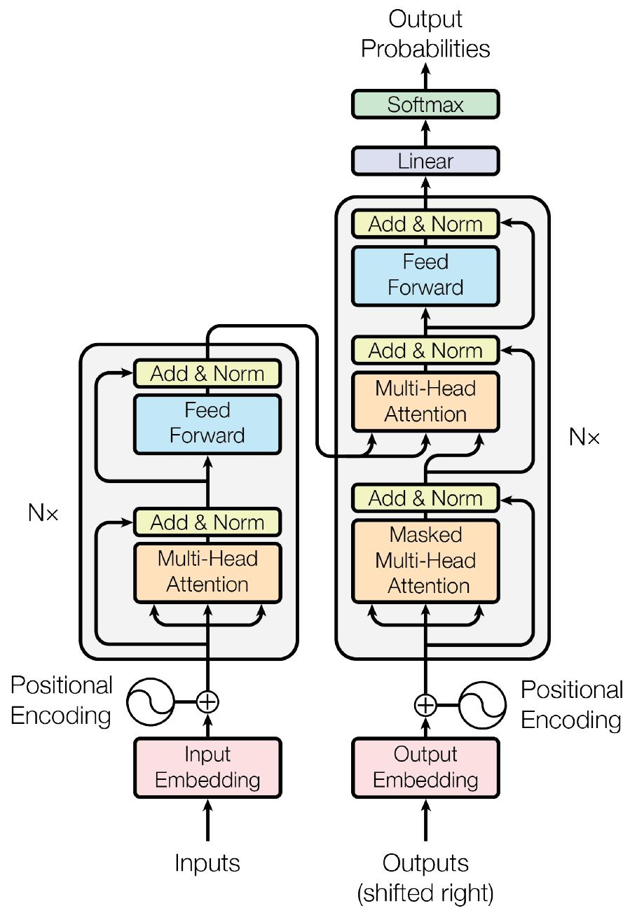

Transformer是一种基于自注意力机制（Self-Attention）的深度学习模型架构。它彻底改变了自然语言处理领域，逐渐取代了之前的RNN和CNN架构，解决了之前RNN架构无法并行处理和长程依赖的问题。  

  

Transfomer有并行化能力强、能更好地捕捉长程依赖、可解释性强等优点。  

## 核心架构

### Encoder（编码器）

编码器的输入为输入序列向量（经过嵌入和位置编码）。输出为一系列向量。

编码器由N个相同的层组成，每层包含两个子层，分别为多头自注意力机制层（Multi-Head Attention）和前馈神经网络层（Feed Forward Network）。每个子层后都接有一个Add（残差链接）& Norm（层归一化，使每个词向量均值为0、方差为1）。  

多头自注意力是编码器的核心。它允许模型同时从多个不同的“关注点”来捕捉序列中每个词语与其他词语之间的关系。它会生成一个上下文感知的表示，其中每个词语的表示都包含了整个输入序列的信息。自注意力机制让模型能够并行处理，并且更好地捕捉长程依赖。  

前馈网络是一个简单的全连接网络，对自注意力层的输出进行非线性转换，进一步增强模型的表示能力。

梯度消失指，由于使用了Sigmoid或Tanh这样的非线性激活函数，大部分导数小于1，导数连乘使梯度指数级减小，意味着模型靠前参数几乎不被更新，无法有效地学习到浅层特征，从而训练停滞，性能无法提升。残差连接的公式为  

$$
LayerNorm(x + subLayer(x))
$$

$$
LayerNorm(x) = \gamma \cdot (x - \mu) / \sqrt{\sigma^2 + \epsilon} + \beta
$$

LayerNorm首先将参数由正态分布归一化（$\epsilon$用于防止除0），$\gamma$和$\beta$是两个可学习参数，为缩放因子和偏移量，允许模型对分布进行一定调整，不会丢失重要的特征信息。  

残差连接将子层输入与输出相加并进行归一化，避免梯度消失。

层归一化通过规范化每层的输入，使模型的训练过程更加稳定，避免了“内部协变量偏移”（Internal Covariate Shift）问题，使得模型可以使用更高的学习率，从而加快训练速度。

（学习率：步长，新参数 = 旧参数 - 学习率 × 梯度）

### Decoder （解码器）

解码器输入为目标序列（同样也通过嵌入和位置编码）；输出为下一个词的概率分布。

解码器同样包含N个层，每层包含三个子层，为带掩码的多头自注意力机制、多头自注意力和前馈网络。同样每个子层后都带有残差连接和层归一化。

带掩码的多头自注意力与编码器中的自注意力类似，增加掩码，在训练和推理过程中，解码器在生成当前词时只能看到它之前的词，而不能看到之后的词，保证了模型在生成序列时是按顺序进行的。

此外，解码器的多头自注意力和编码器不同，它的Q来自自己上一层的输出，K、V来自编码器的输出。这使得解码器在生成每个词时，能够关注到输入序列（编码器输出）中最相关的部分。

## 自注意力机制

自注意力机制的基本思想是：计算序列中每个词语与所有其他词语之间的相关性，并将这些相关性作为权重，对所有词语的表示进行加权求和，从而得到一个新的、包含上下文信息的表示。

每个词向量被矩阵映射出Q、K、V三个向量，每个Q和所有K点积得到相似度，作为注意力得分，将得分缩放（防止梯度过小），然后应用Softmax函数，将注意力得分转为权重，加权求和为最终的注意力输出。

$$
Attention(Q,K,V) = Softmax(QK^T/\sqrt{d_k})V
$$

除以$\sqrt{d_k}$的目的是防止点积结果过大，导致softmax结果趋近于0或1。Softmax得到的结果为注意力权重，代表在生成每个token的新表示时，应该给予序列中其他所有token的关注度。在和V相乘后，最终的输出向量不仅包含自身的信息，还融合了整个序列中所有相关 token 的信息。

### 多头自注意力

多头注意力是自注意力的扩展。它不是只计算一次注意力，而是将 Q、K、V 映射到多个不同的子空间中，分别计算多个独立的注意力结果，最后将这些结果拼接起来，再通过一个线性层进行整合。不同头关注句子中不同的信息（语法/语义），提高了模型稳定性。  

具体来说，Q、K、V被投影成h个更小的向量，模型并行地对每组Q、K、V进行运算。结束后得到h个输出矩阵，拼接后得到最终矩阵。  

多头自注意力机制使得模型能够同时从多个不同的角度捕捉序列中词语之间的关系。这不仅解决了单一注意力机制的局限性，还显著提高了模型的性能、泛化能力和表示能力。

### 带掩码的多头自注意力

掩码是一个特殊的矩阵，用于屏蔽矩阵中有关未来的信息。在Transformer中，掩码矩阵是一个上三角矩阵，对角线上的值被设为极小负数（$-\infty$）。  

在进行Softmax归一化前，将掩码矩阵加到注意力矩阵上，原始得分就会变为极大负数。Softmax函数为指数函数，注意力权重就会变为0，没有任何贡献，不会被模型关注。  

$$
Softmax(z_i) = e^{z_i} / \Sigma^K_{j = 1} e^{z_j}
$$

其中z为输入向量。