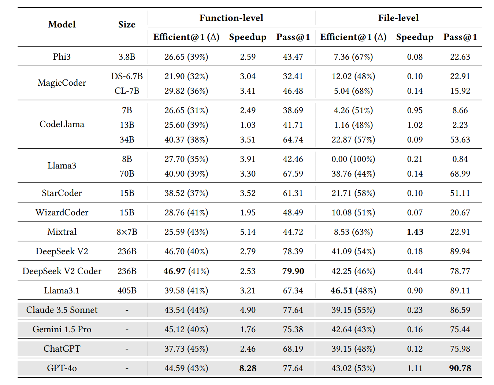
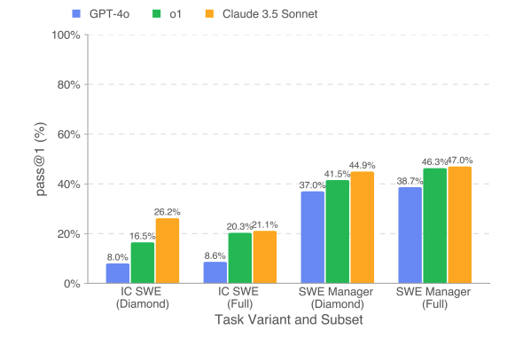
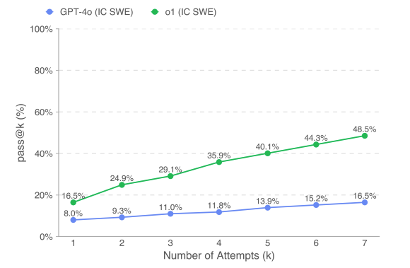
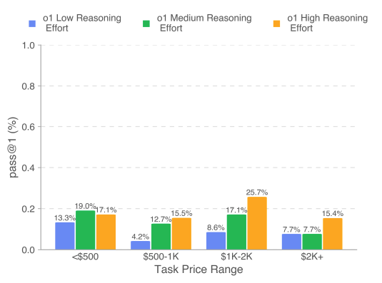
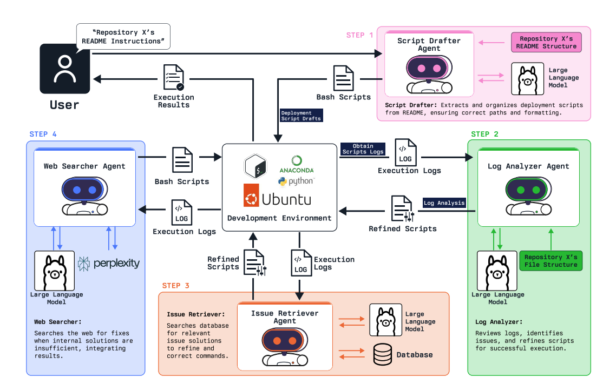
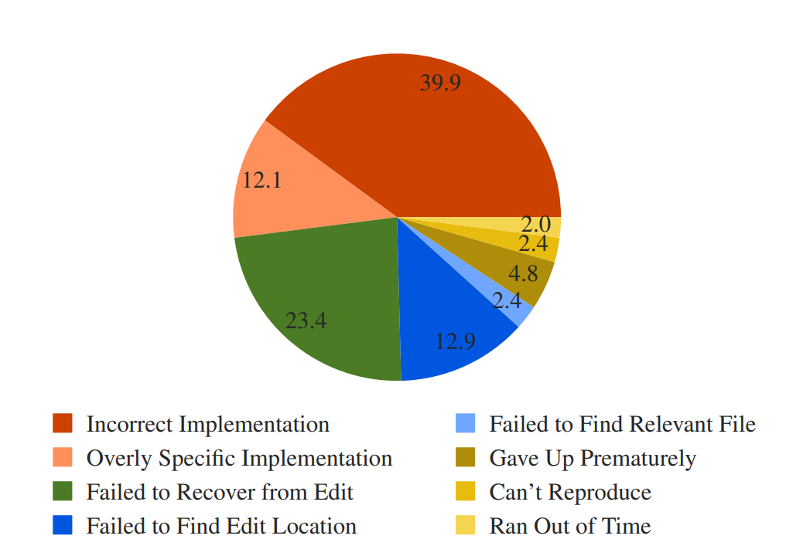
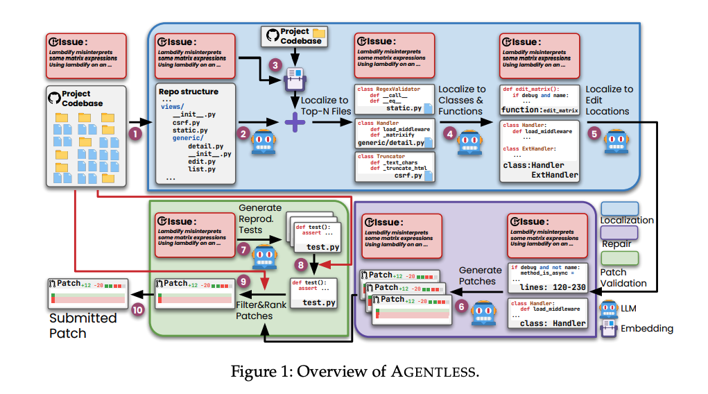

## RES-Q: Evaluating Code-Editing Large Language Model Systems at the Repository Scale

工作：
1. 构建RES-Q：源于github的代码编辑数据集
2. 用数据集评估
3. 提供了评估入口

每个数据包含
- 自然语言指定需要修改的内容（bug fix/new features等）
- 完整代码库

结论：
1. 限制上下文窗口（8k）：claude 3.5 sonnet、gpt-4o下降，开源模型提升（无法有效利用上下文）
2. 大部分闭源优于开源
3. claude性能强，token使用多；gpt-4o相对性能较好，但token使用量异常低。说明claude早期犯错后期改正，而gpt更擅长在早期做出正确决策。

简评：非常简要的一篇文章，数据集的构建和评测都没有给出很明确的流程（但是给了接口）。实验最后也没有给出对llm（与大型仓库交互）相关能力的评价，感觉只是以仓库数据为基础横向对比了几个模型。

## COFFE: A Code Efficiency Benchmark for Code Generation

背景：  
1. 缺少评估llm代码效率的方案
2. 当前代码评估不够稳定/全面，不适合效率评测
    - 执行时间依赖运行环境
    - 需要大规模输入才能通过代码运行时长判断复杂度

工作：
1. 构建了COFFE基准测试体系和新指标efficient@k，对现有多个模型进行了评测
2. 提出了STGen，基于LLM生成压力测试

结论：

- 模型pass@1相对高，efficient@1低
- 参数更大的模型不会表现出更好的性能

efficient@k公式和pass@k一样，计算“快于最优基准解决方案数量”。通过CPU指令数（和基线程序的指令数之比）判断代码的高效与否。

简评：efficient@k只考虑了代码复杂度是否“超过某个限度”，并不能定量地反馈生成代码的性能，指标严重依赖基线，更适合定性地比较不同模型的性能差异。加速比相对来说可以反馈代码性能，但是同样依赖基线。此外，这里的CPU指令数没有考虑不同指令的差异，只能用作横向比较（或许代码复杂到一定程度后可以忽略这些差异）。

## RefactorBench: Evaluating Stateful Reasoning in Language Agents through Code

背景：GitHub快照导致数据本身存在噪声；智能体可以执行核心子任务，但需要评估通用能力  

工作：
1. RefactorBench重构数据集（通过9个库构建了100多个任务）
2. 通过数据集评估多个开源系统
3. 评估得到“三种失败模式”
4. 构建状态感知接口，提高了agent推理能力

工作具体说明：
1. 任务集修改文件数：2-31，平均为4。是否考虑构建更大规模的重构？
2. 通过ast验证重构是否正确

结论：
1. 当前agent存在过拟合（某些智能体习惯解决github问题，将重构误认为修bug）
2. 三种失败模式：
  1. 无法定位文件位置（需要修改6个以上文件的任务全部失败）
  2. 某些任务需要先引入错误才能修改成功（在智能体编辑时一直启动即时检查，可能会降低agent能力）
  3. 上下文淹没

简评：与其说这篇论文关注重构本身，不如说它是以重构作为范本，评测模型多文件推理的能力，以及第六部分（状态感知接口）和其它部分有些割裂，有点像多轮对话（或者说大家都是那一套？）。同时，文中也说明了，目前的lm agent存在过拟合，原因之一是缺乏多样化的评估手段。此外目前的数据集里全都是python任务。

## RefAgent: A Multi-agent LLM-based Framework for Automatic Software Refactoring

工作：
1. 设计了refagent，包含四个agent重构
2. 在8个实际项目中实测
3. 消融实验

RefAgent共分为四个模块
1. 上下文感知
2. 重构代码生成
3. 编译
4. 测试（重构不能改变功能）

以RefGen（一个基于搜索的重构工具）作为基线，计算precision、召回率和f1。这种方式假设RefGen是100%正确的，感觉指标不太合适。  

简评：基本就是讲故事。此外，这个工具只能进行“提高代码质量”的重构，感觉和“跨文件重构”的语境有区别，而且没有考虑api变更适配等情境。此工具只适用Java项目。

## An Empirical Study on the Code Refactoring Capability of Large Language Models

评测了startcoder的重构能力（考虑到数据污染等原因，只评测了这一个模型）
工作：
1. 评估startcoder
2. 提供了评估框架
3. 比较不同prompt的影响

数据集构建：
1. 选择20-mad数据集，排除提交次数少、生命周期短、提交历史少的项目
2. 过滤starcoder训练数据
3. 过滤重构较少的项目

结论：
1. startcoder的代码质量比人类开发者略高；但人类在解耦合等方面做得更好
2. 人类更擅长处理更复杂、上下文相关的任务
3. one-shot和cot带来显著提升，zero-shot不明显

简评：论文结论是，llm擅长解决“实现级别”的代码质量问题（空catch、魔法数字等），人类更擅长解决复杂问题。这是比较显然的，因为简单的质量问题往往都有固定模式。接下来，一方面可以考虑增强llm处理简单问题的可靠性，考虑将其作为一个类似checkstyle的插件使用；另一方面，也可以考虑增强llm重构复杂问题的能力，我觉得后者更有价值。

## Refactoring Programs Using Large Language Models with Few-Shot Examples

（上一篇的related work，比较早的工作。感觉可以看作最早的讲llm用于重构的工作）

工作：
1. 证明llm有重构能力
2. 用few-shot增强llm能力
3. 构建了一个数据集（不知道为什么这个没有写到工作里）

简评：23年的工作，数据集为python，且都是非常简单的问题。看完之后发现和“重构”关系不大，只是用few-shot提升代码质量。感觉现在专门做过重构的论文没有多少。

## SWE-bench Verified

OpenAI对swe-bench的改进。  
原有的数据集存在问题描述不清、需要额外上下文、单元测试要求过高（如硬编码exception输出）或和所需不匹配等问题。

数据集构建：
1. 数据标注，标注了问题清晰程度（0-3，最清晰-最不清晰）
2. 过滤模糊程度大于等于2的样本（可能导致移除的假阳性过高）
3. 尽可能多地纳入难度1～4小时/大于4小时（较高的两个难度等级）的样本，对剩余随机抽样

改进后原有模型在各个难度分布上的能力都有上升。

想法：OpenAI提到要关注生态的发展（使用rag2.7%，使用coder28.3%），是否有工作评估了现有生态对llm的影响/不同生态的影响？

## Multi-SWE-bench: a Multilingual Benchmark for Issue Resolving

工作：
1. 涵盖7种语言的benchmark
2. 评估了多款模型

benchmark构建：
1. 筛选优质代码库，包含ci/cd支持
2. 筛选关联issue/feature的pr，且包含正确性测试
3. 环境配置、测试pr

最终包含java、typescript、c++、rust等语言（没有python），其中c++/rust修改一般规模比较大

实验：
1. 扩展了三种方式：agentless、swe-agent、openhands
2. 指标：成功定位率、平均成本

结论：
1. 对问题难度敏感，基本无法解决人工所需时长超过一小时的问题；
2. 不同语言能力有显著差异，对于java/python同样的任务，python有明显优势（swe-agent等是基于python优化的）
3. openhands表现最好（openhands、swe-agent、agentless 7：5：1），但qwen和eepseek更适合agentless
4. openhands的性能不稳定（交互轮数离散度较高）
5. 大量问题无法被精确定位，agentless的定位能力强但解决能力弱
6. 文件、行数增加，解决率倾向下降（相对不明显）；语言熵增加，解决率下降（相对明显），如下图，语言熵公式为$H(L) = \Sigma_{i=1}^n p_i log(p_i)$
其中$\{p_1,p_2...p_n\}$表示各个语言在仓库中所有语言的比例，即仓库使用语言越少，解决率越高  
7. 评估了补丁（长度/跨文件）、问题类型、问题描述  
8. 成本和语言、评测方法都有相关性，agentless表现出最高的token消耗，但由于交互次数较少，平均成本更低

简评：多语言benchmark，成本很高。数据来自bug fix、new feature和功能优化，成功率递减。工作中包含大量的数据分析。其中ts和js语言的特定案例比较多（长上下文/无法提取代码结构/长时交互），设计新benchmark需要特殊考虑。

## SWE-Lancer: Can Frontier LLM Earn $1 Million From Real-World Freelance Software Engineering?

工作：
1. 根据expensify在upwork发布的任务（现实的工程任务）构建benchmark  
    - 数据集包含普通代码生成任务和“manager”任务（模型作为技术主管，选择最佳技术方案）
    - 数据集平均解决时间26天，难度较高
    - 74%任务设计应用逻辑，17%设计ui/ux（忽略）

实验说明：
1. 模型配备了“user tool”，可以运行并查看结果
2. 每个agent只有一次尝试机会
3. 评估了测试时计算量、尝试次数、移除用户工具的影响

结论：
1. 成本分析
    - 先让模型尝试一次，如果尝试失败则交给人类，节省约10%
    - 交给人类之前尝试5次，分别节省18.6%、33.5%
2. 对于ic任务，diamond数据集的表现反倒比完整数据集更好（下图1）
3. k和pass@k有非常强的线性关系（下图2）
4. 问题越难，增加推理成本就越能增强能力（具体见下图3）
5. 对于比较弱的模型（这里是gpt-4o），提供工具基本不会增强模型能力

简评：成本非常高的工作。数据集构建和实验流程写得非常泛泛，并且只公开了一部分。此外，对于模型定位，这篇文章给出了和上一篇相反的结论。

## CSR-Bench: Benchmarking LLM Agents in Deployment of Computer Science Research Repositories

工作：
1. 推出csr-bench以评估模型部署能力，并评测模型
2. 推出csr-agents框架
3. 设计标准化测试，保证csr-bench结果可复现

数据集来源各个顶会相关的GitHub仓库  
智能体设计如图，总而言之就是加上rag和网络搜索增加成功率

  

结论：
1. step1（script drafter agent，最初尝试生成部署命令）的成功率接近0，rag、web search等都会帮助提升成功率  

简评：本质上是部署benchmark和（没什么特别的）agent，但是讲成了“部署agent”->“简化复现代码流程”->“简化cs研究”的故事。完成度有限，只关注了自身agent各个模块带来的成功率影响，甚至没有各个模型能力的横向对比图。模型能力对比、rl等都没涉及，只能说拓宽了一个新的领域，给新工作留了很多空间

## SWT-Bench: Testing and Validating Real-World Bug-Fixes with Code Agents

工作：
1. 推出swt-bench，测试生成benchmark
2. 评估多种测试生成方法

数据集：
1. 从github python库中拉去pr，并筛选
2. 评估了补丁格式正确率（测试格式正确）、成功率（测试可以成功复现问题）和覆盖率

结论：  
1. 上下文长度增加，成功率先上升后下降；具体分布根据生成方法而异
2. 不同测试方法解决的问题特征没有相关性，具体见图
3. 生成复现测试成功率和修复成功率不相关

简评：从github pr引进的数据集，判断测试能否复现问题，感觉并不是很符合测试生成这种情境，或者说只考虑复现这一情境。此外，数据集还是只有python代码。

## CrossCodeEval: a Diverse and Multilingual Benchmark for Cross-File Code Completion  

多语言benchmark，包括python、java、ts和c#，关注跨文件上下文理解。

工作：
1. 包含四种语言、跨文件的benchmark
2. 评估模型，并验证benchmark的有效性
3. 测试检索方法，证实crosscodeeval可以用作代码检索能力评估

数据集筛选：
1. 筛选日期，避免泄漏；筛选语言、常用训练数据等
2. 只保留源代码文件数在10～50

简评：比较早的多语言benchmark。数据集中限制了仓库的文件数，感觉10～50文件数的规模还是偏小。用了大量篇幅说明ai必须有跨文件上下文才能完成跨文件任务（现在看来很显然），比评估completion更像评估retrieval。

## RepoGraph: Enhancing AI Software Engineering with Repository-Level Code Graph

工作：
1. 提出repograph（插件），利用图表示代码结构，粒度细到每一行
2. 与四个现有框架集成，用swe-bench评估，成功率**相对**提升了38.2%
3. 其它分析

repograph步骤：
1. 通过tree-sitter解析，重点关注函数和类的引用
2. 排除python内置和第三方来源库
3. 构建图：点分为def和ref两种，边分为contain和invoke两种
4. 搜索时，以搜索项为中心k-hop

整个流程被封装成一个工具给agent调用。

以普通rag和agentless作为基线，评估准确率和平均成本，用swe-bench-lite测试。  

结论：  
1. repograph带来的性能提升不依赖成本
2. 程序框架和agent框架相比，有（略微）更优的表现和更低的成本。
3. 正确定位是解决问题的必要不充分条件

简评：逻辑很清晰，不是“炼丹”性质的工作；某种意义上说用很简单的手段达成了不错的效果，并且这个插件带来的效果提升很符合直觉。不过正文给出的成本不包含时间，不确定对于大型代码库效率如何。

（graph相关的工作好像还不少，暂时只看了这一篇）

## SWE-agent: Agent-Computer Interfaces Enable Automated Software Engineering

背景：lm agent被设计与shell、python等交互，但是无法与vscode等界面交互（24年5月的工作，比较早）

工作：  
1. 开发了agent-computer interface，作为agent与计算机之间的中间层（swe-agent）
2. 评估swe-agent能力

swe-agent包含四个组件：检索、文件查看、文件编辑、上下文管理。

实验结果：  
1. 相比rag和只与shell交互，有**非常显著**的性能提升；但**仍然**只完成了swe-bench lite 18%的任务
2. 大多数失败属于incorrect implementations，及实现本身失败。而这里的“incorrect implementations”中，有一部分是“过于具体的实现”，即llm生成的方案通用性不足（论文把下图中的incorrect implementation和overly specific implementation归为一类）
3. agent的流程一般为定位/复现->编辑代码->执行->编辑->执行...
4. 成功快，失败慢。成功的运行成本都更低；也就是说，增强预算很可能无法增强性能。

简评：这是24年5月的论文，好像那个时候的cursor还没有agent模式。很多benchmark把这里的swe-agent（和下面的agentless）作为基线之一。（另外，这篇论文正文极其简要，把所有乱七八糟的东西全塞到附录里了，附录有一百多页）

## Agentless: Demystifying LLM-based Software Engineering Agents

（24年七月发表，同样被很多工作作为基线）

背景：
1. agent工具的设计成本较高
2. agent的决策很大程度依赖之前的决策（agent对决策本身的感知有限），可能会进行大量无意义操作；这些无意义操作又会干扰agent的下一步决策
3. 缺乏自我反思能力，会全盘接受各种反馈

工作：  
1. 设计agentless，无需代理，解决se问题
2. 通过swe-bench lite评估
3. 构建了swe-bench list-s数据集（swe-bench verified是基于同一方向发布的）

结构如下

思考：
1. 这份工作构建了swe-bench lite-s，去除了“问题描述含误导性解决方案”。如果要解决实际工程问题，会不会大多数问题描述都是有问题的？能否增强agent的容错性？
2. 如果issue涉及到改变原有方案，可能原来的回归测试无法通过，需要删除一部分。文章里直接用llm筛掉了有影响的回归测试，这种方案会不会有问题

简评：agentless相比许多同时期（或者之前的工作），同时表现出高性能和极低的成本。它的低成本完全不意外。与其说明这篇文章证明了什么，不如说agent在成本方面还有许多问题需要解决；agentless的性价比低并不代表它的能力强，只能说明agent成本太高。对比随后的很多工作，agentless的性能不太够看了，但是性价比方面仍然很优秀。