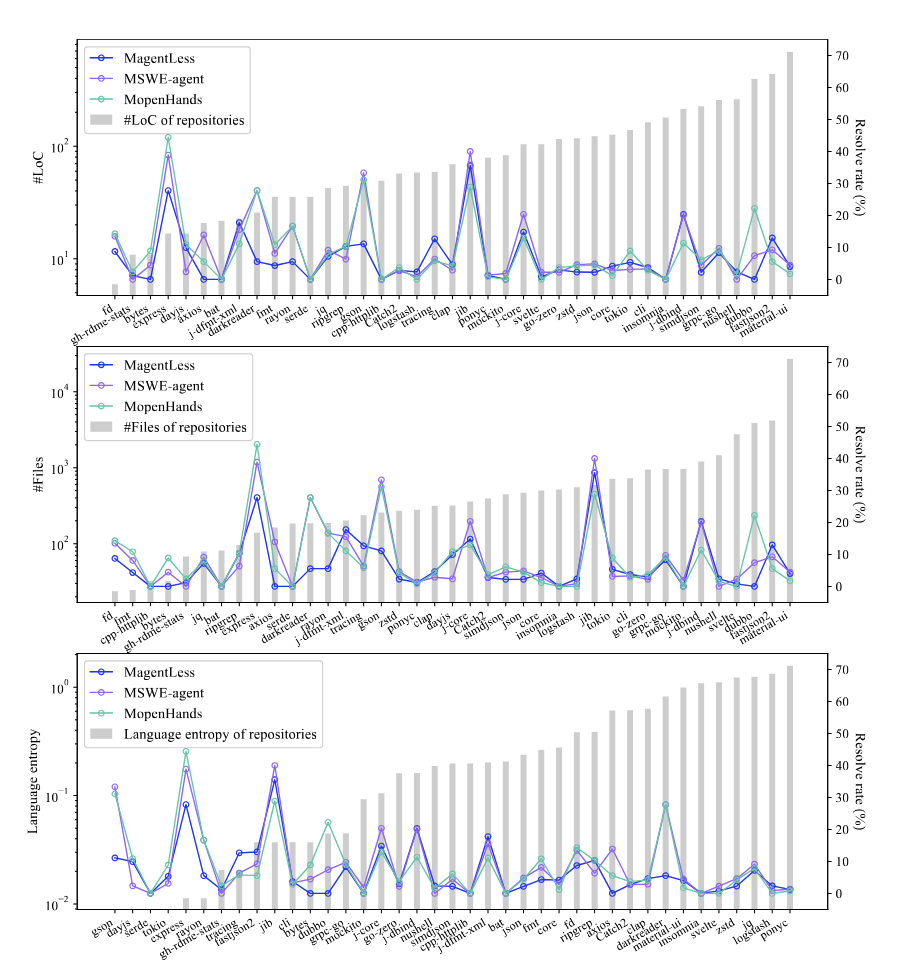

## Multi-SWE-bench: a Multilingual Benchmark for Issue Resolving

工作：
1. 涵盖7种语言的benchmark
2. 评估了多款模型

benchmark构建：
1. 筛选优质代码库，包含ci/cd支持
2. 筛选关联issue/feature的pr，且包含正确性测试
3. 环境配置、测试pr

最终包含java、typescript、c++、rust等语言（没有python），其中c++/rust修改一般规模比较大

实验：
1. 扩展了三种方式：agentless、swe-agent、openhands
2. 指标：成功定位率、平均成本

结论：
1. 对问题难度敏感，基本无法解决人工所需时长超过一小时的问题；
2. 不同语言能力有显著差异，对于java/python同样的任务，python有明显优势（swe-agent等是基于python优化的）
3. openhands表现最好（openhands、swe-agent、agentless 7：5：1），但qwen和eepseek更适合agentless
4. openhands的性能不稳定（交互轮数离散度较高）
5. 大量问题无法被精确定位，agentless的定位能力强但解决能力弱
6. 文件、行数增加，解决率倾向下降（相对不明显）；语言熵增加，解决率下降（相对明显），如下图，语言熵公式为$H(L) = \Sigma_{i=1}^n p_i log(p_i)$
其中$\{p_1,p_2...p_n\}$表示各个语言在仓库中所有语言的比例，即仓库使用语言越少，解决率越高  
7. 评估了补丁（长度/跨文件）、问题类型、问题描述  
8. 成本和语言、评测方法都有相关性，agentless表现出最高的token消耗，但由于交互次数较少，平均成本更低

简评：多语言benchmark，成本很高。数据来自bug fix、new feature和功能优化，成功率递减。工作中包含大量的数据分析。其中ts和js语言的特定案例比较多（长上下文/无法提取代码结构/长时交互），设计新benchmark需要特殊考虑。