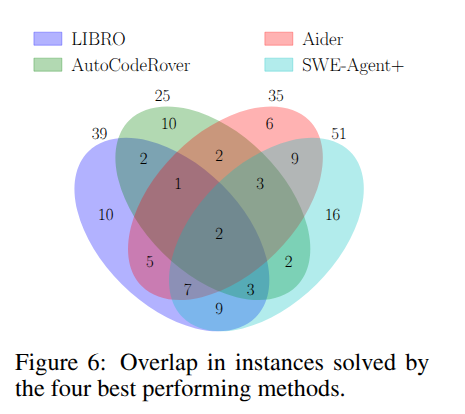

## SWT-Bench: Testing and Validating Real-World Bug-Fixes with Code Agents

工作：
1. 推出swt-bench，测试生成benchmark
2. 评估多种测试生成方法

数据集：
1. 从github python库中拉去pr，并筛选
2. 评估了补丁格式正确率（测试格式正确）、成功率（测试可以成功复现问题）和覆盖率

结论：  
1. 上下文长度增加，成功率先上升后下降；具体分布根据生成方法而异
2. 不同测试方法解决的问题特征没有相关性，具体见图
3. 生成复现测试成功率和修复成功率不相关

简评：从github pr引进的数据集，判断测试能否复现问题，感觉并不是很符合测试生成这种情境，或者说只考虑复现这一情境。此外，数据集还是只有python代码。