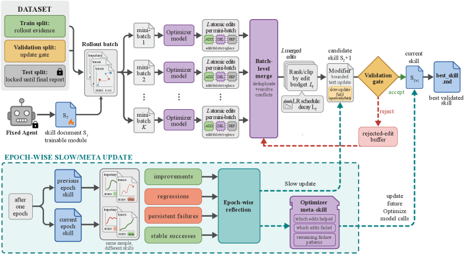

# SkillOpt

论文：SkillOpt: Executive Strategy for Self-Evolving Agent Skills  
arxiv：[https://www.arxiv.org/abs/2605.23904](https://www.arxiv.org/abs/2605.23904)

---

summary：skillopt是一个支持skill自进化的框架。在特定任务上达到了avg 39分提升

可以理解为用train model的思路去train skill。包含了训练/验证/测试集 + rollout等等。这个东西应该和之前skillbench说的“agent造出的低分skill”不是一个概念。

具体流程如图：

逻辑速览：
1. 数据集划分
2. 交互产生rollout
3. 根据交互成功情况划分batch（这里的*训练*可以认为是离线的，交互是否成功已经在数据里了）
4. optimizer model根据rollout写edit，受到预算限制
5. 合并edit
6. optimizer model对候选skill做排序+裁剪
7. 跑validation
8. 获得最好的skill
9. 优化optimizer model：每个batch总结被拒绝的修改；每个epoch总结全局方法论

optimizer model edit时的上下文结构：
- role
- 全局方法论记忆
- current skill
- 每个batch的错误总结
- 一个mini batch的轨迹
- 目标

每条数据是针对同一个skill的不同问题。对每条数据，agent会与某个特定的skill交互，生成数条轨迹。optimizer model负责筛选出成功/失败轨迹（或许更适合称为正样本/负样本），并进行原子化编辑，不会重写文档。每个编辑都需要进行验证，确保实际带来了提升；没有带来提升的编辑会给作为以后的负样本。系统会收集修改、通过各种bench打分、排序。在每个epoch结束后，还有一轮比较完整的验证，包括回归、stablity等。

这里的预算仅是修改范围，没有考虑单次修改的长度。不过考虑到比较全面的验证 + 各种prompt，或许完全可以接受（或者说，其实*预算*只是一个锦上添花的限制，作用约等于prompt）

key findings大概只包含算分……不过最后提到了best skill只有400到2000tokens，大概率是设计skill的一个方向。不过这个前提是要求skill（大体上）**只有文档**，甚至最好是只有一个描述文档

想法：还挺有趣的工作
- 纵观llm的相关概念，感觉skill是最适合去做类似train的对象（甚至感觉是唯一的对象）。之前的prompt太轻，harness太重，mcp和tool感觉意义不大
- （比较个人观点）不过仍然停留在优化*skill*本身，感觉对现在来说skill本身的写法不是问题来源
- 直觉上，如果一轮一直运行，会导致optimizer上下文逐渐爆掉。不过**单个**skill的修改应该是有极限的，所以可能不会有这种问题
- 提到了同一个best skill在所有model上都会有好的表现（符合直觉）。不知道有没有文章探索过不同model使用skill的能力如何？可能直接看skillbench？但是我仍然认为目前“如何使用skill”是一个未解决的问题。如果这个没有共识，感觉跑一些测model的skill bench也意义有限
- 注意skill也会产生过拟合（例如在skill里写死什么），所以需要训练/测试集等的划分
- 这里的optimizer model似乎不太像rl中的哪个具体角色；它负责写edit，同时会自进化

*无关：最近一直想搓各种各样的agent，但是没空……感觉可以搓一个树状搜索论文的agent，不过应该去哪找搜索key呢*