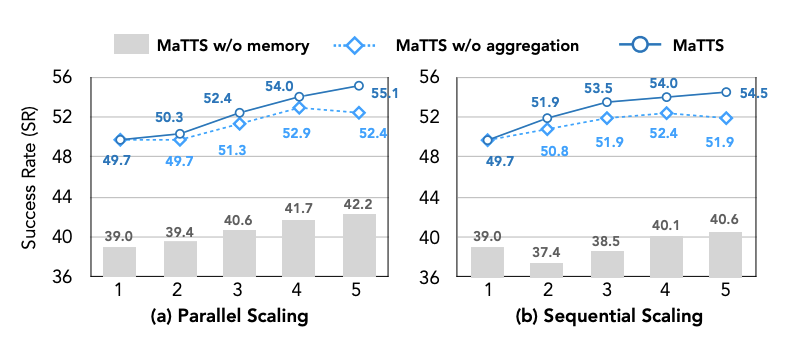

# ReasoningBank

论文：ReasoningBank: Scaling Agent Self-Evolving with Reasoning Memory   
arxiv：[https://arxiv.org/abs/2509.25140](https://arxiv.org/abs/2509.25140)

---

summary：将raw logs总结为knowledge，保存successful reasoning pattern

memory结构：
- title：策略总结
- description：可以理解为比title具体、比content简略
- content：reasoning steps、推理线索

检索：用agent context检索；计算top-k个相似度最高的item。memory被插入到system instruction中。  
提取：通过llm-judge。success和fail的情况都会提取

MaTTS：memory-aware test-time scaling

tts可以理解为对推理截断应用scaling law。可以分为并行和串行两种：  
- 并行：对同一个任务生成n条轨迹
- 串行：先完成一次任务，进行n-1次自我修正

加入reasoningBank后会提升tts的表现。不过并行和串行没有表现出太大差别。

（蓝色实线代表best，蓝色虚线代表随机抽样）

想法：快看完了才发现是25年9月的，有点旧了。现在看来感觉不太成熟
- 提取全部依赖llm-judge。很简单的情况不会fail；很难的情况llm-judge不一定能起到正向作用。直觉上真的能依靠**这种**机制得到提升的情况是很少的
- 如果每次失败都提取，感觉可能会积累大量低价值无意义的、针对某些特定情况的memory
- 提到了平均减少了1.6-2.8step。不过如果考虑extraction的llm成本，感觉不一定会真的节省？但是减少step应该某种意义上代表能力提升（感觉像把维护对话上下文的成本扔给了memory bank。从这种思路来说何尝不是一种compression）