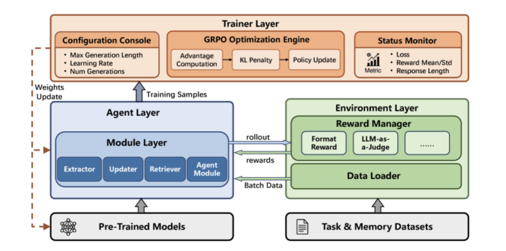

# MemFactory

论文：MemFactory: Unified Inference & Training Framework for Agent Memory    
arxiv：

---

summary：训一个模型去管理记忆。设计了包含记忆管理和相关训练的、相对模块化的结构

分为四层：module layer、agent layer、environment layer、trainer layer

   

- module layer：extractor、updater（memory crud）、retriever和agent。每个模块都可以生成rollout。其中agent module允许实现端到端的逻辑，不需要采用extractor等  
- agent layer：包含module layer。其中module layer中的各个模块是可替换的
- environment layer：包含reward和数据存储（数据库等）

采用grpo训练

想法：文章的分析有点少……看不太出什么，大概只是提供了一种memory处理思路。不知道对memory训模型会不会用力过猛