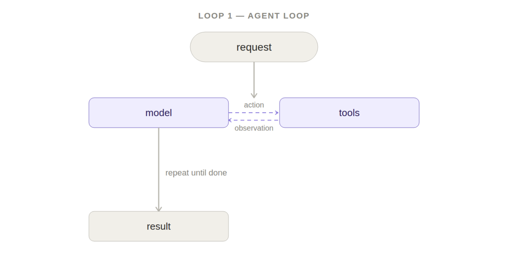
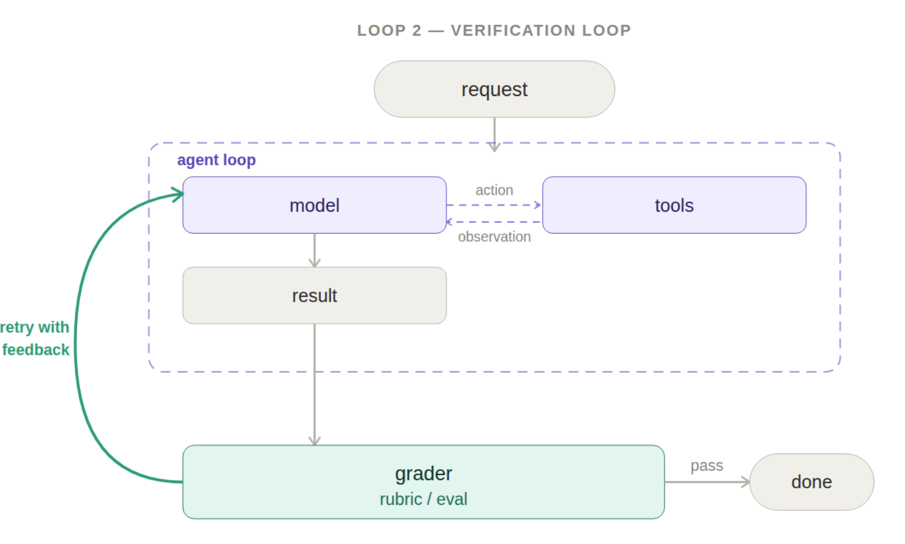
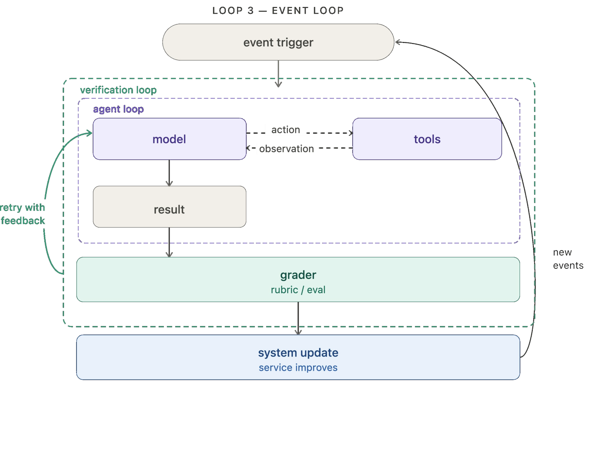
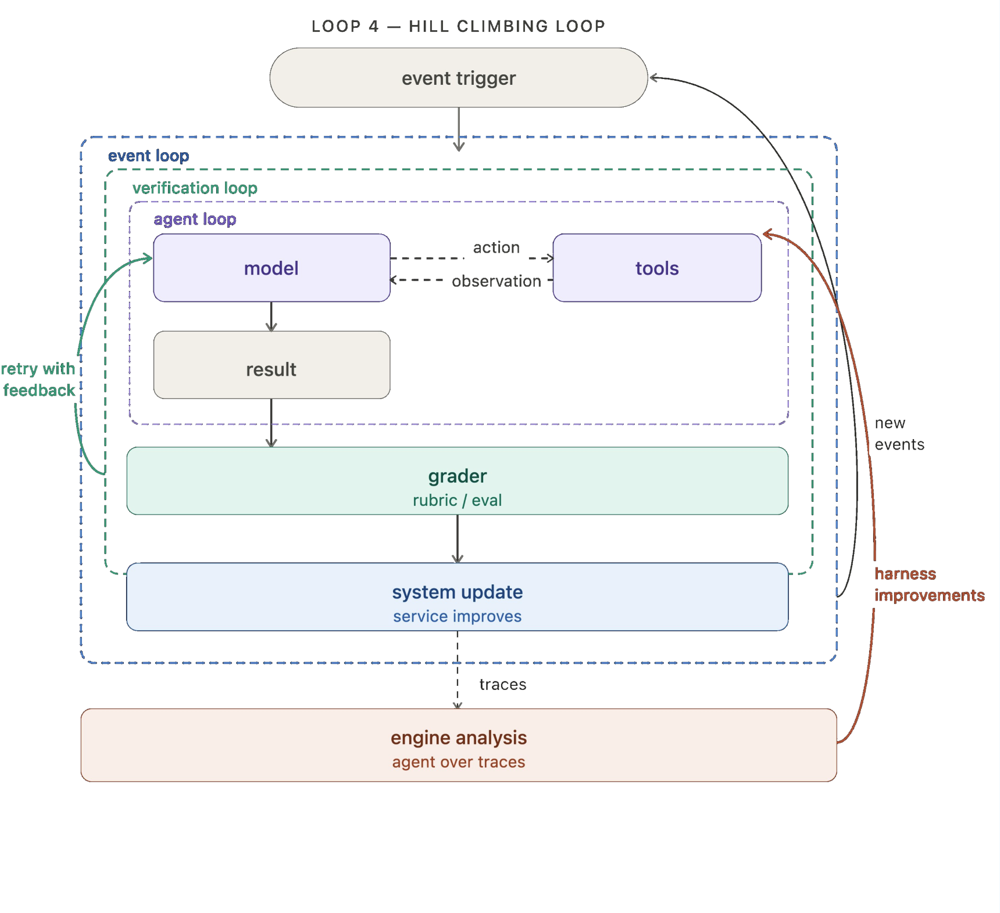

# Loops

标题：The Art of Loop Engineering    
链接：[https://www.langchain.com/blog/the-art-of-loop-engineering](https://www.langchain.com/blog/the-art-of-loop-engineering)

---

*其实不太确定langchain的博客质量如何。但是实在没找到合适的loop engineering论文*

看了一下，里面很多部分还是在介绍langchain本身。不过里面给出了四个loop，大概可以参考一下。印象里之前anthropic的blog提到了其中一部分，但是应该还没有涉及self-evolve之类。

## Loop1: react

没什么好说的

## Loop2: verification

这里的grader似乎更偏向某个*具体的、确定的*内容，例如test pass等等。如果将其换成一个agent，就比较贴近anthropic之前提到的multi-agent模式之一。

## Loop3: event driven

与前两个的区别是，agent的**调用**不再由人类手动触发，而是由某个事件（例如，邮件到达）驱动。

## Loop4: self-evolve

会做一些**轨迹分析**，引入了一个analysis agent来自进化。

大概是对loop的一个概括，比较科普

*loop engineering究竟是没开始发paper还是我没找到啊……不擅长找文献……*